# console 不止 log

> Console 对象提供对浏览器控制台的接入（如：Firefox 的 Web Console）。不同浏览器上它的工作方式是不一样的，但这里会介绍一些大都会提供的接口特性。
> Console对象可以在任何全局对象中访问，如 Window，WorkerGlobalScope 以及通过属性工作台提供的特殊定义。
> 它被浏览器定义为 Window.Console，也可被简单的 Console 调用。

对于前端开发人员来说，最基础也是使用最频繁的功能莫过于`console.log()`，它用于在控制台打印相关信息，必要时，可以利用它调试`bug`。但是，`console`还有许多其他的用法。

**tips:**因为__console 对象提供对浏览器控制台的接入__，所以不同的浏览器支持形式可能有些出入。

本文基于`chrome`浏览器进行测试，如有出入，请自行辨别。

## 分类输出

**console.log()/console.info()/console.warn()/console.error()**

用于输出不同类别的信息

```js
console.log('文字信息');
console.info('提示信息');
console.warn('警告信息');
console.error('错误信息');
```

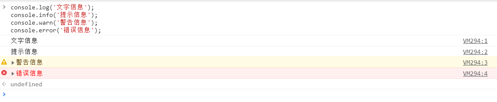

## 分组输出

**console.group()/console.groupCollapsed()/console.groupEnd()**

在 Web 控制台上创建一个新的分组.随后输出到控制台上的内容都会被添加一个缩进,表示该内容属于当前分组,直到调用`console.groupEnd()`之后,当前分组结束。

`console.groupCollapsed()`与`console.group()`类似，只不过前者的分组以折叠的形式输出。

```js
console.group('第一个组');
    console.log("1-1");
    console.log("1-2");
    console.log("1-3");
console.groupEnd();

console.group('第二个组');
    console.log("2-1");
    console.log("2-2");
    console.log("2-3");
console.groupEnd();
```

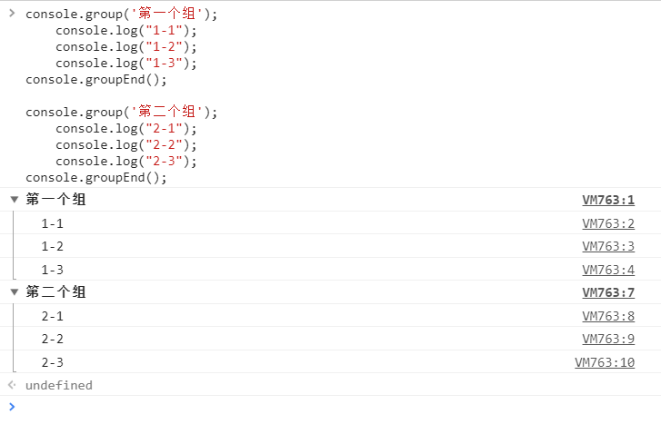

`console.group()`还可以用于嵌套调用，以显示多级分组。

```js
console.group('第一个组');
    console.group("1-1");
        console.group("1-1-1");
            console.log('内容');
        console.groupEnd();
    console.groupEnd();
    console.group("1-2");
        console.log('内容');
        console.log('内容');
        console.log('内容');
    console.groupEnd();
console.groupEnd();

console.groupCollapsed('第二个组');
    console.group("2-1");
    console.groupEnd();
    console.group("2-2");
    console.groupEnd();
console.groupEnd();
```

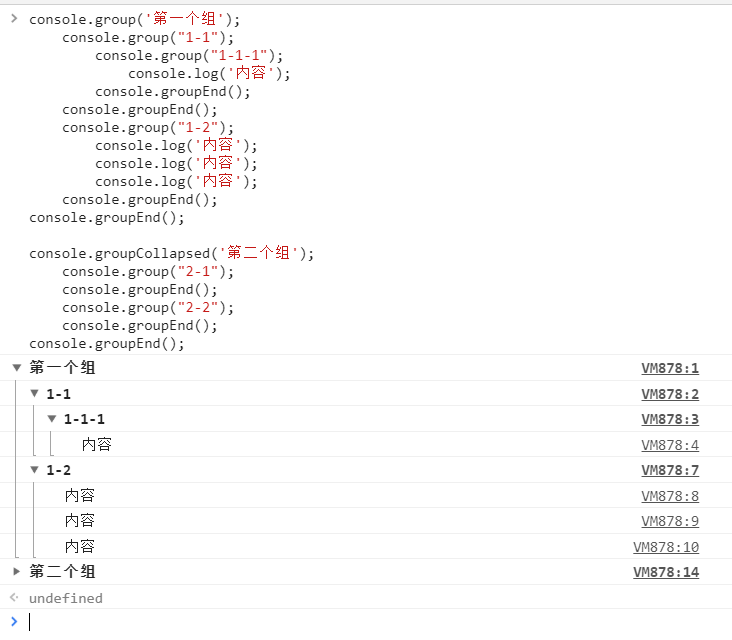

## 表格输出

**console.table()**

使用`console.table()`可以将传入的对象、数组以表格的形式输出到控制台上，以整齐的形式排列元素。

```js
var Obj = {
    Obj1: {
        a: "aaa",
        b: "bbb",
        c: "ccc"
    },
    Obj2: {
        a: "aaa",
        b: "bbb",
        c: "ccc"
    },
    Obj3: {
        a: "aaa",
        b: "bbb",
        c: "ccc"
    },
    Obj4: {
        a: "aaa",
        b: "bbb",
        c: "ccc"
    }
}

var Arr = [
    ["aa","bb","cc"],
    ["dd","ee","ff"],
    ["gg","hh","ii"],
]
console.table(Obj);
console.table(Arr);
```

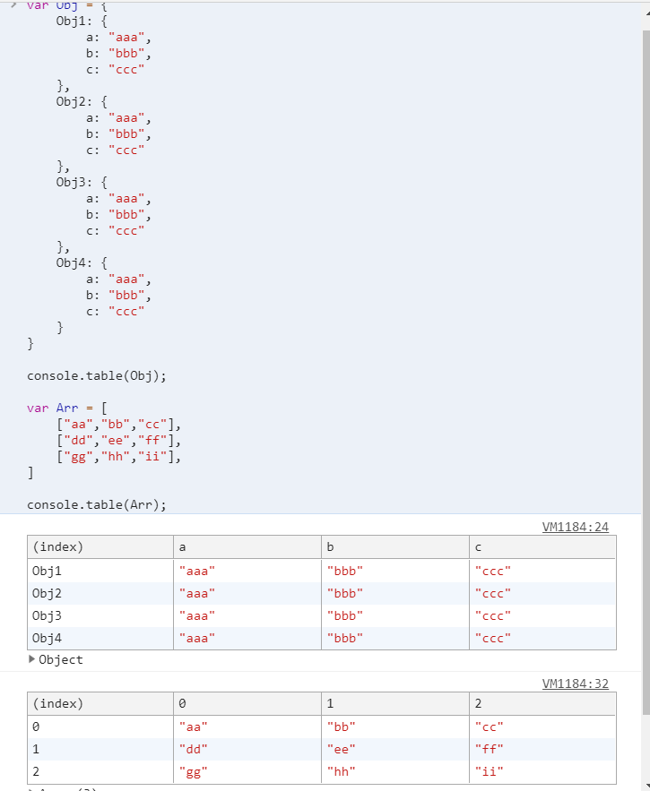

## 查看对象

**console.dir()**

在控制台中显示指定的 JavaScript 对象的属性，并通过类似文件树样式的交互列表显示。

```js
console.dir(document.location)
```

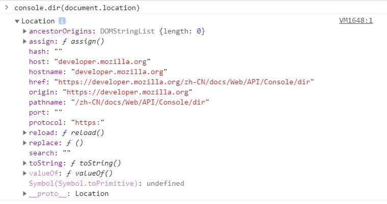

## 查看dom节点

**console.dirxml()**

显示一个明确的 XML/HTML 元素的包括所有后代元素的交互树。如果无法作为一个 element 被显示，那么会以 JavaScript 对象的形式作为替代。

```js
console.dirxml(document)
```

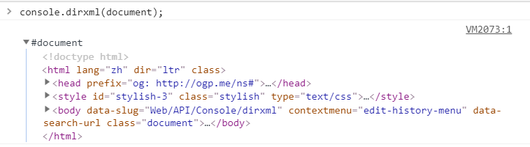

## 条件输出

**console.assert()**

利用`console.assert()`，可以进行条件输出。

- 当首个参数或返回值为`true`时，不输出内容
- 当首个参数或返回值为`false`时，输出后面的内容同时抛出错误

```js
console.assert(true, "不会出错");
console.assert((function() { return true;})(), "不会出错");

console.assert(false, "会出错");
console.assert((function() { return false;})(), "会出错");
```

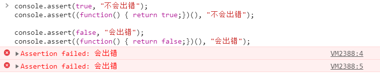

## 计次输出

**console.count()/console.countReset()**

使用`console.count()`输出内容和被调用的次数。

使用`console.countReset()`可以将被调用的`count`次数重置为`0`。

```js
(function () {
    for(var i = 0; i < 3; i++){
        console.count("运行次数：");
    }
})()
```

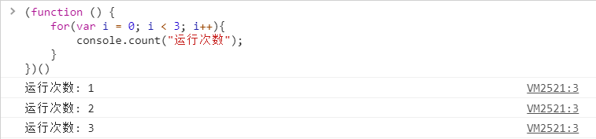

## 追踪调用堆栈

**console.trace()**

使用`console.trace()`来追踪函数被调用的过程，在复杂的项目中灵活的运用，可以快速定位`bug`。

```js
function add(a, b) {
    console.trace("Add function");
    return a + b;
}

function add3(a, b) {
    return add2(a, b);
}

function add2(a, b) {
    return add1(a, b);
}

function add1(a, b) {
    return add(a, b);
}

var x = add3(1, 1);
```

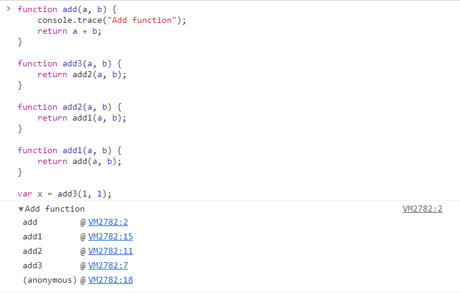

## 运行计时

**console.time()/console.timeEnd()**

通过`console`启动一个计时器（timer）来跟踪某一个操作所占时长。

- 为了便于区分，每个定时器必须拥有唯一的名字
- 同一页面内允许运行的最大计时器数为`10000`

当以此计时器名字为参数调用`console.timeEnd()`时，浏览器将以毫秒为单位，输出对应计时器所经过的时间。

```js
console.time("Chrome中循环1000次的时间");
for(var i = 0; i < 1000; i++){}
console.timeEnd("Chrome中循环1000次的时间");
```

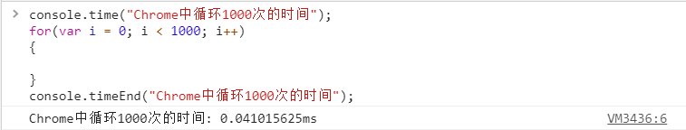

## console.log()中的黑科技

`console.log()`除了打印信息以外，还有很多其他的使用方法。

### 提示输出

最基本也是最普遍的调用方式，可以在输出的对象、变量前加上提示性信息，以作区分。

```js
var num = 12345;
console.log("这是临时变量num的值：",num);
```

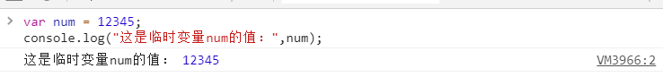

### 格式化输出

| 占位符   | 含义                                                 |
| -------- | ---------------------------------------------------- |
| %s       | 字符串输出                                           |
| %d or %i | 整数输出                                             |
| %f       | 浮点数输出                                           |
| %o       | 打印 JavaScript 对象，可以是整数、字符串或 JSON 数据 |

```js
var arr = ["小明", "小红"];

console.log("欢迎%s和%s两位新同学",arr[0],arr[1]);

console.log("圆周率整数部分：%d，带上小数是：%f",3.1415,3.1415);
```

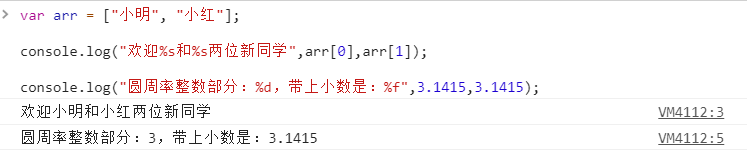

### 自定义样式

使用`%c`为打印内容定义样式。

在输出的信息前面添加`%c`，后面写上标准的 css 样式，就可以为输出的信息添加样式。

```js
console.log("%cMy stylish message", "color: red; font-style: italic");

console.log("%c3D Text", " text-shadow: 0 1px 0 #ccc,0 2px 0 #c9c9c9,0 3px 0 #bbb,0 4px 0 #b9b9b9,0 5px 0 #aaa,0 6px 1px rgba(0,0,0,.1),0 0 5px rgba(0,0,0,.1),0 1px 3px rgba(0,0,0,.3),0 3px 5px rgba(0,0,0,.2),0 5px 10px rgba(0,0,0,.25),0 10px 10px rgba(0,0,0,.2),0 20px 20px rgba(0,0,0,.15);font-size:5em");

console.log('%cRainbow Text ', 'background-image:-webkit-gradient( linear, left top, right top, color-stop(0, #f22), color-stop(0.15, #f2f), color-stop(0.3, #22f), color-stop(0.45, #2ff), color-stop(0.6, #2f2),color-stop(0.75, #2f2), color-stop(0.9, #ff2), color-stop(1, #f22) );color:transparent;-webkit-background-clip: text;font-size:5em;');

console.log('%cMy name is classicemi.', 'color: #fff; background: #f40; font-size: 24px;');
```

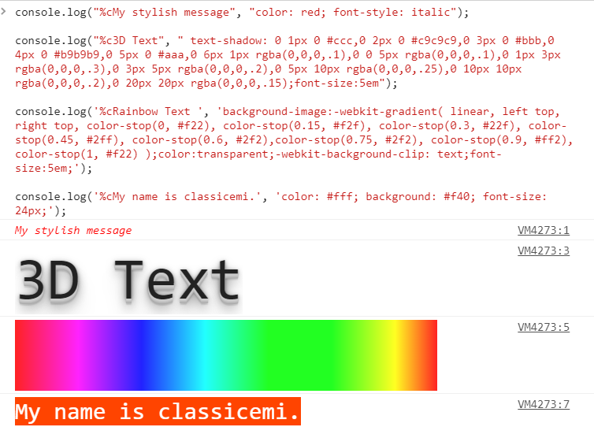

## 总结

尽管`console`的用法很多，有一些在调试过程中还非常实用，但是，如果是在生产环境下，尽量不要使用上述部分功能，这有可能会造成无法预知的错误。

## 参考

[https://developer.mozilla.org/zh-CN/docs/Web/API/Console](https://developer.mozilla.org/zh-CN/docs/Web/API/Console)

[[Javascript调试命令——你只会Console.log() ?](https://segmentfault.com/a/1190000012957199)](https://segmentfault.com/a/1190000012957199)

