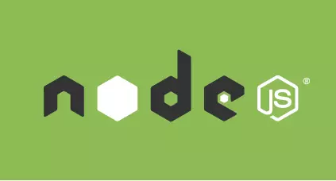
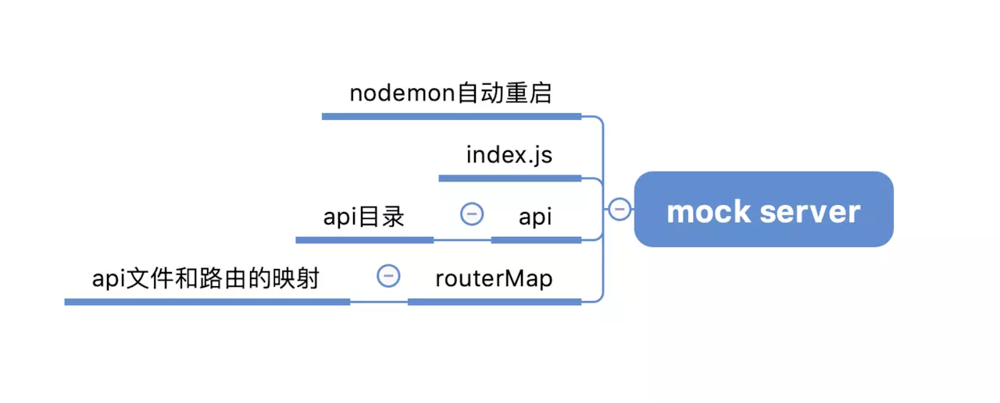
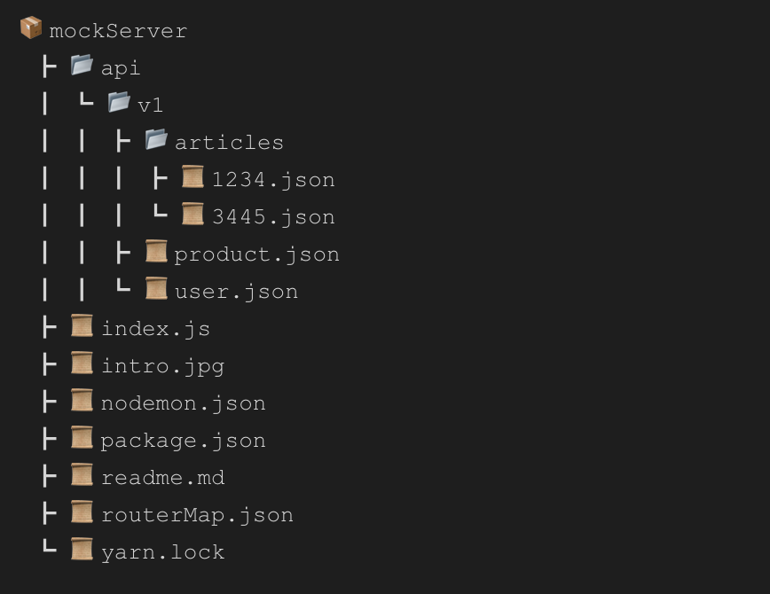

# 用 Node 实现 mock 数据服务器



随着前端工程的发展与繁荣，JavaScript 扮演的角色越来越重要，自 Node 出现之后，它不仅可以为浏览器赋能，在 Web 服务器方面也制造了很大的价值。

本文将利用 Node 搭建一个简单的 mock 服务器，方便前端开发人员 mock 数据请求。

## mock 服务器实现的基本思路

通过目录路径以及服务端 api 之间的关系映射，来实现 api 的访问。

举个例子： 当我们在浏览器访问接口`api/userInfo`时，我们只需要在 api 文件夹下创建一个`userInfo.json`的文件即可，json 文件数据根据需求自行定义即可。



## 实现

1. 搭建一个基于 Koa 的 node端服务（原生node或 express 类似）

   ```js
   // index.js
   const Koa = require('koa')
   
   const server = new Koa()
   
   server.listen(8000,() => {
       console.log('server running at *8000')
   })
   ```

2. **注册路由**

   通过 koa-router 来实现后台的路由功能，并通过 koa 提供的上下文参数 ctx 将读取到的数据返回给前端：

   ```js
   // index.js
   const Koa = require('koa')
   const router = require('koa-router')({prefix: '/api'})
   const server = new Koa()
   
   router.get('/userInfo',async ctx => {
       ctx.body = {
           name: 'Lucas',
           age: 18,
           gender: 'male'
       }
   })
   server
   	.use(router.routes())
   	.use(router.allowedMethods())
       .listen(8000,() => {
       console.log('server running at *8000')
   })
   ```

   通过上述代码便实现了一个基本的 api 服务器，当我们在浏览器中访问 `api/userInfo`时，就会返回 ctx.body 中的数据。

3. **自动注册 api 接口并返回数据**

   该阶段实现 api 服务的自动注册，这里通过 第三方模块`glob`来遍历目录，并通过 node 的系统模块`fs` 读取 api 中的 json 数据返回给前台。

   关于 glob，感兴趣的可以[查看这里](https://www.npmjs.com/package/glob),本文只做简单应用，不具体深入。

   ```js
   // index.js
   const {resolve} = require('path')
   const {STATUS_CODES} = require('http')
   const fs = require('fs')
   const Koa = require('koa')
   const router = require('koa-router')({prefix: '/api'})
   const glob = require('glob')
   const server = new Koa()
   // 注册路由
   glob.sync(resolve(__dirname,'./api','**/*.json')).forEach(filename => {
       let apiPath = filename && filename.split('/api')[1]
       const api = apiPath.replace('.json','')
       router.get(api,async ctx => {
          try {
            const data = JSON.parse(fs.readFileSync(filename).toString())
               ctx.body = {
                   data,
                   state: STATUS_CODES['200']
               }
          } catch (e) {
              ctx.throw(500,e.message)
          }
       })
   })
   
   
   server
   	.use(router.routes())
   	.use(router.allowedMethods())
       .listen(8000,() => {
       console.log('server running at *8000')
   })
   ```

4. **添加 日志**

   使用 koa-logger 实现服务端的数据请求的输出，方便调试。

   ```js
   const logger = require('koa-logger')
   server.use(logger())
   ```

5. **路由映射文件生成**

   通过生成一个路由映射文件，简单理解接口相关信息。

   ```js
   // index.js
   const {resolve} = require('path')
   const {STATUS_CODES} = require('http')
   const fs = require('fs')
   const Koa = require('koa')
   const router = require('koa-router')({prefix: '/api'})
   const glob = require('glob')
   const server = new Koa()
   let routeMap = {}
   // 注册路由
   glob.sync(resolve(__dirname,'./api','**/*.json')).forEach(filename => {
       let apiPath = filename && filename.split('/api')[1]
       const api = apiPath.replace('.json','')
       router.get(api,async ctx => {
          try {
            const data = JSON.parse(fs.readFileSync(filename).toString())
               ctx.body = {
                   data,
                   state: STATUS_CODES['200']
               }
              routeMap[apiPath] = api
          } catch (e) {
              ctx.throw(500,e.message)
          }
       })
   })
   
   fs.writeFile(resolve(__dirname,'./routeMap.json'), JSON.stringify(routeMap,null,4), err => {
       if (!err) {
           console.log(`generate routeMap`)
       }
   })
   
   server
   	.use(router.routes())
   	.use(router.allowedMethods())
       .listen(8000,() => {
       console.log('server running at *8000')
   })
   ```

   

## 参考链接

[5分钟教你用nodeJS手写一个mock数据服务器](https://juejin.im/post/5d7345bce51d453b76258503)

