# 爬虫，其实就是这么简单

## 爬虫及Robots协议

> **爬虫**，是一种自动获取网页内容的程序。是搜索引擎的重要组成部门，因此搜索引擎去优化很大程度上就是针对爬虫而做出的优化。

> **Robots协议**（也称为爬虫协议、机器人协议等）的全称是“网络爬虫排除标准”（Robots Exclusion Protocol），网站通过Robots协议告诉搜索引擎哪些页面可以抓取，哪些页面不能抓取。

robots.txt 文件是一个文本文件，使用任何一种常用的文本编辑器都可以创建和编辑它。robots.txt 是一种协议，而不是一个命令。robots.txt是搜索引擎访问网站时要查看的第一个文件，它告诉爬虫在服务器上什么文件是可以被查看的。

下图是**豆瓣电影**页面关于 robots 协议列出的可以访问的范围。

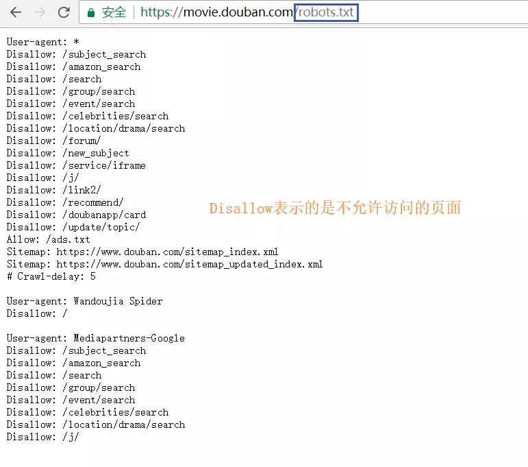

爬虫和 Robots 协议是紧密相连的，图中看到的不允许爬的页面就不可以去爬，如果涉及到用户的隐私问题，被发现后就会被起诉。

因此业界普遍认可 Robots 协议，当然也存在无视协议强行爬取的情况，本文不做详解，如有兴趣，可以查看[Robots 协议](https://baike.baidu.com/item/robots协议/2483797#7_1)

通过下图，简单梳理一下所说内容。

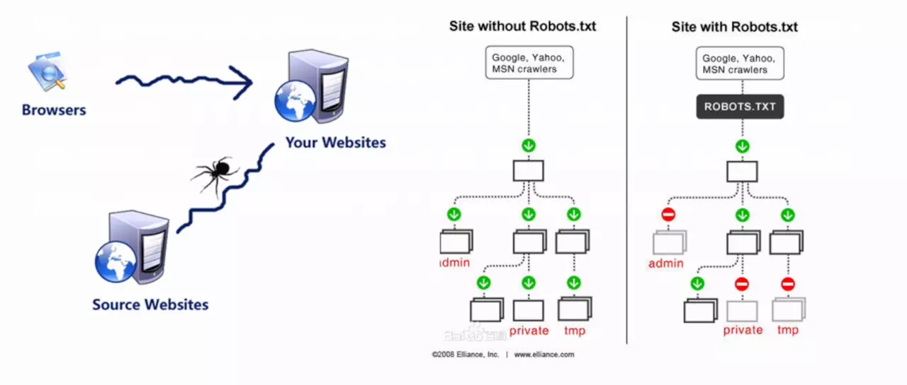

虽然上文进行了简要概括，但是可能还是会不明白，爬虫到底**爬的是什么**？

其实简单来说，就是爬虫获取了某个特定页面的一段**html代码**，这对前端`er`来并不陌生，只是需要我们将它**转换成Dom树**即可。

接下来，再看一下上图中的右半部分，这是一张**对比图**

**左边**是**没有**限定**Robots协议**的，正常情况下，类似`admin/private`以及`tmp`这三个文件夹是不允许爬取的，但是由于没有**Robots协议**，爬虫可以肆无忌惮的爬取。

而**右边**是经过**Robots协议**限定的，与之相反，像`Google`这种大型搜索引擎也是通过**Robots协议**文件去查看爬取内容的，因此查看到存在`admin/private`相关的文件夹就会直接跳过。

## 爬虫的基本流程

简单来说，爬虫的流程无外乎就以下几点：

- 爬取数据
- 数据入库
- 启动服务
- 渲染数据

### [#](https://dancingtx.github.io/web_blog/blog/Node相关/用Node实现爬虫.html#爬取数据)爬取数据

接下来通过代码演示来爬取豆瓣电影页面的电影相关数据。

下图是整体的目录结构。

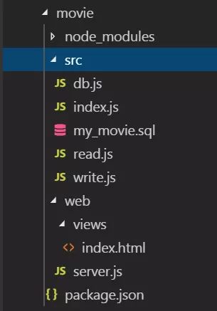

既然是**爬取数据**，就需要用到比较出名的工具------- **Request**

#### [#](https://dancingtx.github.io/web_blog/blog/Node相关/用Node实现爬虫.html#request)Request

那么，**Request**到底如何使用呢？看官方代码感受一下。

```js
var request = require('request');
request('http://www.google.com', function (error, response, body) {
    // 发生错误打印错误日志
  console.log('error:', error);
    // 响应成功打印状态码
  console.log('statusCode:', response && response.statusCode); 
    // 打印Google页面的html 代码体
  console.log('body:', body);
});
```

是不是简单易用？既然**html**页面已经抓取完毕，那么就只需要将其转变为**Dom**即可。

接下来需要用到另外一个工具----**cheeio**

```js
const cheerio = require('cheerio')
const $ = cheerio.load('<h2 class="title">Hello world</h2>')
 
$('h2.title').text('Hello there!')
$('h2').addClass('welcome')
 
$.html()
//=> <html><head></head><body><h2 class="title welcome">Hello there!</h2></body></html>
```

看了上面的代码是否有一种似曾相识的感觉？这不就是**JQuery**吗？对，它被开发人员称为**Node**界的**JQuery**。

既然页面有了，Dom结构也获取到了，那么就开始写爬虫吧。

#### 读取内容

首先根据豆瓣电影的页面进行分析，观察那些是正在热映的电影，先来查看它的**Dom**结构。

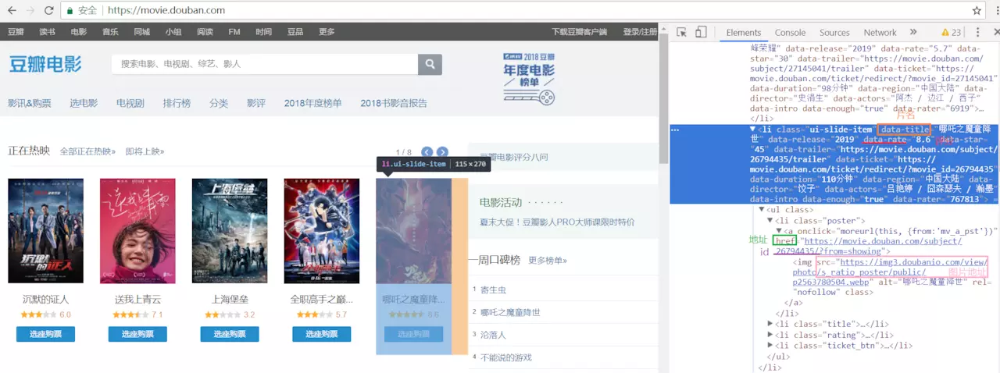

需要的信息已经标注完毕，接下来进入`read.js`文件中。

```js
// read.js

// require-promise 让request 可以支持promise写法，类似的库还有request-promise-native,request-promise-any等，需要注意的是这些库依赖于request，因此在下载这些库时务必也要下载request库
const request = require('request-promise')
// 将抓取的html 代码转换为可操作的dom
const cheeio = require('cheeio')
// debug库，用来在调试阶段查看日志
// 最后在运行程序时debug不起作用时，可以在 package.json 中的 scripts 中加入这样一句话：
//   "debug": "@powershell -Command $env:DEBUG='*';node xxx.js"
// xxx 为启动服务的主文件名
const debug = require('debug')('movie:read')

// 读取页面
const read = async url => {
    debug('开始读取最近上映的电影')
    
    const options = {
        url, // 要爬取的目标页面
        transform: body => {
            // body 为目标页面抓取到的html代码
            // 通过 cheerio.load() 方法将html代码转换成可操作的Dom 结构
            return cheerio.load(body)
        }
    }
    return request(options).then($ => {
        let result = [] // 接收数据的空数组
        
        //遍历热映电影的li
        // 观察页面结构，不同页面标签不尽相同
        $('#screening li.ui-silde-item').each((_,item) => {
            const $ele = $(item)
            //$ele.data() 可以获取页面中data开头的自定义属性
            const name = $ele.data('title')
            const score = $ele.data('rate') || '暂无评分'
            const href = $ele.find('.poster a').attr('href')
            const image = $ele.find('img').attr('src')
            // 影片的相关id可以从href中获取
            const id = href && href.match(/(/d+)/)[1]
            // 为了防止豆瓣防盗链导致裂图，换成 webp 格式加载图片
            image = image ** image.replace(/jpg$/,'webp')
            
            if(!name || !image || ! href) return
            
            result.push({
                name,score,href,image,id
            })
            debug(`正在读取电影：${name}`)
        })
        return result
    })
}
module.exports = read
```

简单梳理一下上述代码做了什么：

- 通过**request**抓取`url`页面的`html`代码
- **cheerio**将`html`转换成了`dom`
- 将所需的内容**存入数组**（名称|评分|地址|图片|id）
- 返回数组并导出`read`方法

### 数据入库

这里通过**mysql**建立数据库用以储存数据。

首先安装**XAMPP**和**Navicat**可视化数据库管理工具。

#### XAMPP启动mysql

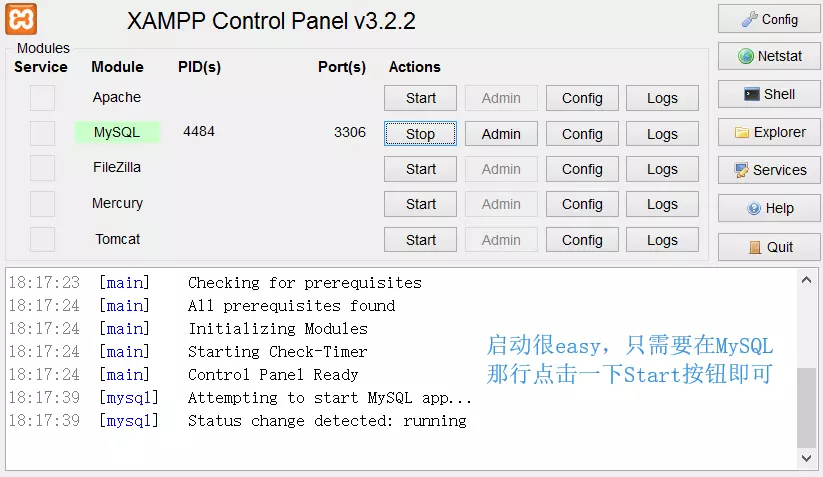

#### Navicat链接数据库以及建表

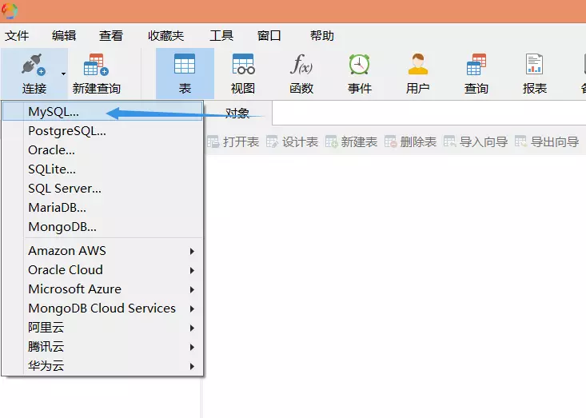

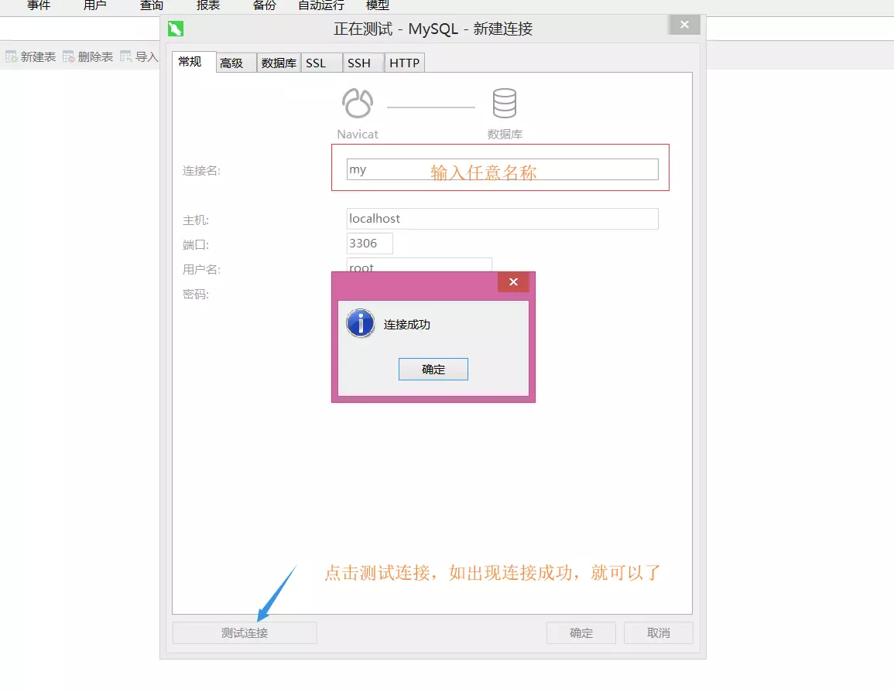

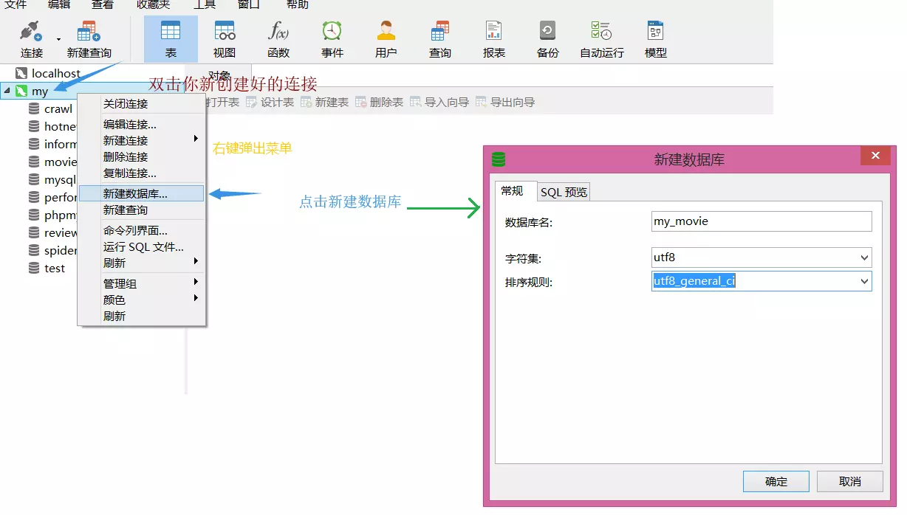

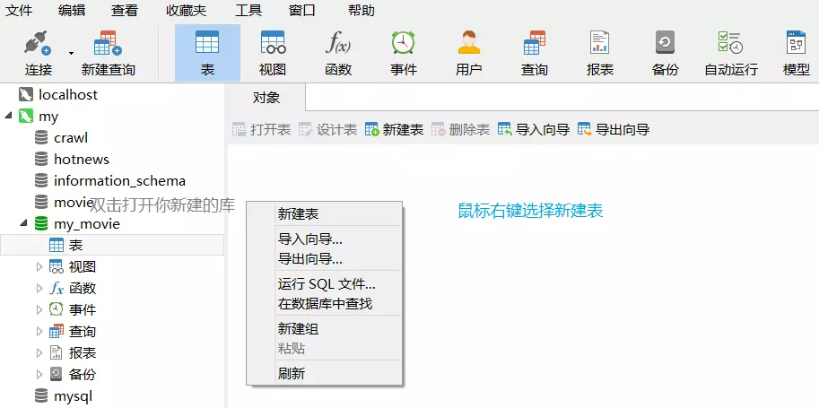

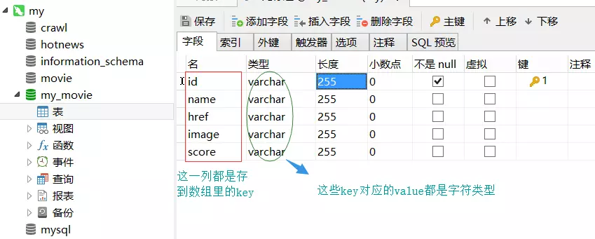

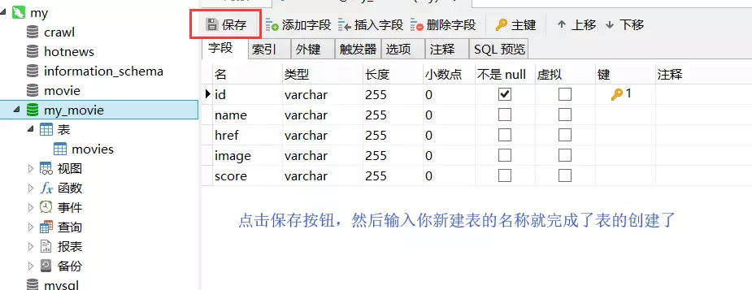

这一部分图有点多，但胜在简洁明了，接下来继续编码。

#### 连接数据库

首先，在`src`目录文件夹下创建一个`sql`文件，这里创建的文件要与数据库同名，因此叫它`my_movie.sql`。

接下来编写连接数据库的代码。

```js
// db.js
const mysql = require('mysql')
// bluebird 方便支持 promise 语义化
const bluebird = require('bluebird')

// 创建连接
const db = mysql.createConnection({
    host:'localhost', // 主机地址 需要与数据库一致
    port: 3306, // 端口号
    database: 'my_movie', //需要连接的数据库
    user: 'root', // 数据库用户名
    password: '' // 数据库密码
})
// 导出数据

module.exports = bluebird.promisify(db.query).bind(db.connect())
```

数据库创建和连接已经完成，接下来就是将获取的数据导入数据库中。

#### 写入数据库

打开`write.js`文件。编写写入数据库的代码

```js
// write.js

const query = require('./db')
const debug = require('debug')('movie:write')

// 写入数据库的方法 
const write = async moives => {
    debug('开始写入电影')
    
    // movies 即为 read.js 中读取到的 result 数组
    movies.forEach((id,name,href,image,score) => {
        // 通过 query 查询 数据库中是否存在该条数据
        const old_movies = await query(`select * from movies where id=? limit 1`,[id])
        
        // sql 查询语句返回一个数组，如果数组不为空，说明之前存在过数据，
        
        // 有数据进行更新
        if(Array.isArray(old_movies) && old_movies.length) {
            // 将当前数据进行更新
            const old_movie = old_movies[0]
            await query(`updata movies set name=?,href=?,image=?,score=? where id=?`,[
                name,href,image,score,old_movie.id
            ])
        } else {
            // 没有数据则将数据直接插入到数据表中
            await query(`insert into movies(id,name,href,image,score) values(?,?,?,?,?)`,[
                id,name,href,image,score
            ])
        }
        debug(`正在写入电影：${name}`)
    })
}

module.exports = write
```

上述代码做了什么：

- 引入`query`方法来进行SQL语句书写
- 遍历读取到的`movies`结果数组
- 查询数据是否存在
  - 存在：更新该项数据
  - 不存在：插入一条新数据

写完了引入数据库的方法后，来简单i讲解一下SQL语句，毕竟SQL语句是大部分前端`er`的痛点。

#### SQL 语句

在上述的`sql`中存在着许多`?`标识符，这里的`?`表示占位符，也可以将数据直接写在`sql`语句中，但一般来说，因为数据比较敏感，为防止遭受SQL注入攻击，因此建议采用`?`占位符。

说到**SQL**，就不得不说它的四大方法-----**增删改查**

1. 插入数据

   ```sql
   # 语法：
   	INSERT INTO 表名(列名) VALUES(列名对应值)
   # 示例：
   	INSERT INTO table(name,id,url) VALUES('爬虫',10,'https://news.so.com/hotnews')
   # 解释：
   	向table表中插入一条数据，数据的信息为 名字，id，访问地址 以及 相对应的各项数据
   ```

2. 更新数据

   ```sql
   # 语法
   	UPDATE 表名 SET 列名=更新值 WHERE 更新条件
   # 示例：
   	UPDATE articles SET title='你好，世界',content='世界没你想的那么糟！' WHERE id=1
   # 解释：
   	更新id为1的文章，标题和内容都想进行了修改
   # 注意：更新数据时务必加上更新条件，否则会将库中所有数据都进行更新
   ```

3. 删除数据

   ```sql
   # 语法：
       DELETE FROM 表名 WHERE 删除条件
   # 示例：
       DELETE FROM tags WHERE id=11
   # 解释：
       从标签表(tags)里删除id为11的数据
   ```

4. 查询数据(查询数据比较繁琐，此处只写简单语法，如感兴趣，可以学习一下`sql`语句)

   ```sql
   语法：
       SELECT 列名 FROM 表名 WHERE 查询条件 ORDER BY 排序列名
   栗子：
       SELECT name,title,content FROM tags WHERE id=8
   解释：
       查询id为8的标签表里对应信息
   ```

   讲述了一下，接下来回归正题，开始检验代码成果。

#### [#](https://dancingtx.github.io/web_blog/blog/Node相关/用Node实现爬虫.html#执行读写操作)执行读写操作

通过`index.js`页面，将`read.js`和`write.js`联系起来。

```js
// index.js

const read = require('./read')
const write = require('./write')
const url = 'https://movie.douban.com' // 目标页面

;(async () => {
    // 异步抓取目标页面
    const movies = await read(url)
    // 写入数据到数据库
    await write(movies)
    // 程序执行完毕，退出
    process.exit()
})()
```

下图为执行结果

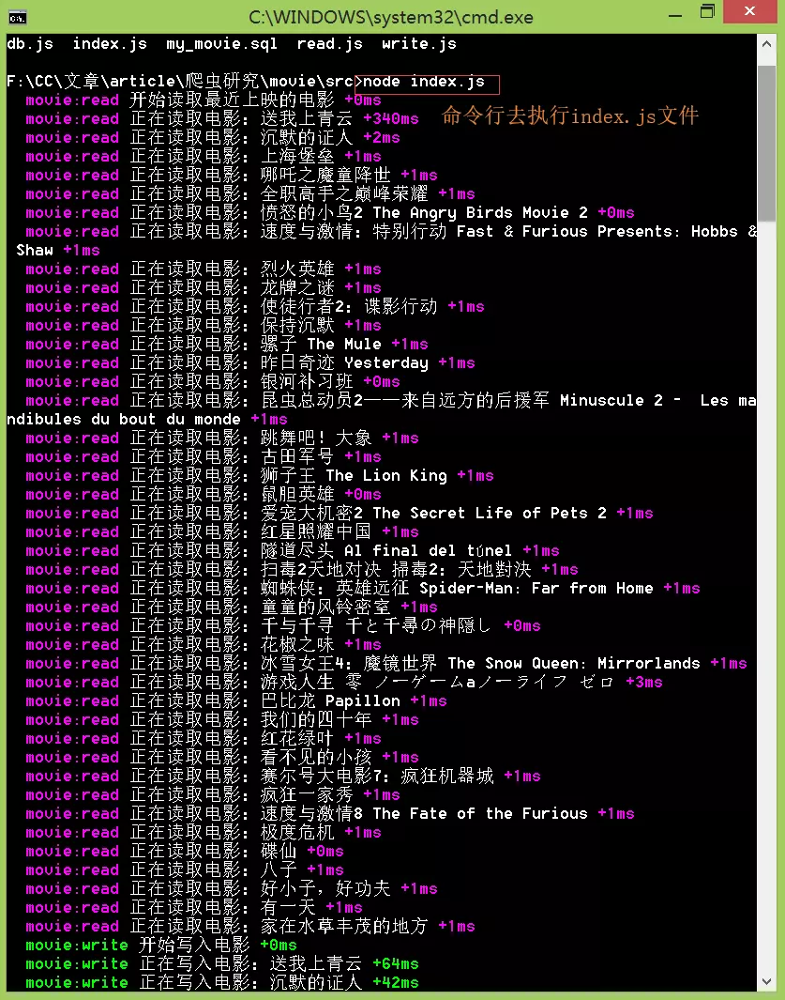

接下来查看数据库中是否已经导入数据。

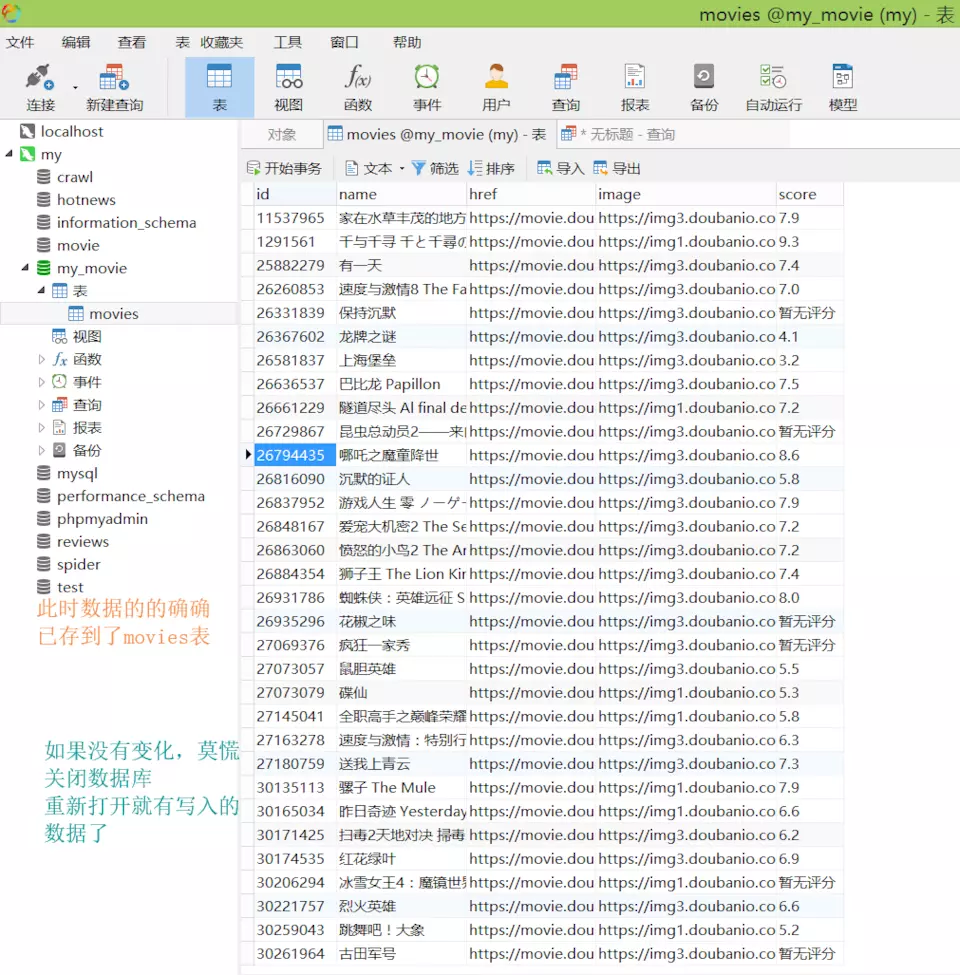

可以看到数据已经成功导入到数据库中。

但是，似乎还缺少点什么？

接下来，我们通过简单的页面渲染，将我们爬取到的数据渲染到浏览器中。

### 启动服务

接下来，开始创建一个`server`服务。

#### server服务

```js
// server.js

const path = require('path')
const express = require('express')
const debug = require('debug')('server')
const query = require('../src/db')
const serve = express()

// 设置渲染模板引擎
serve.set('view engine','html')
serve.set('views',path.join(__dirname,'views'))
serve.engine('html',require('ejs').__express)

// 首页路由
serve.get('/',async (req,res) => {
    // 通过sql查询语句获取movies表中的数据
   	const movies = await query('select * from movies')
    // 渲染首页模板将 movies 中的数据传递进去
    res.render('index',{movies})
})

// 监听端口
serve.listen(3000,() => {
    debug('server running at port 3000')
})
```

`server.js`完成后，最后编写`index.html`页面，将传递给该页面的数据渲染出来。

### 渲染数据

```ejs
// index.html

<!DOCTYPE html>
<html lang="en">
<head>
    <meta charset="UTF-8">
    <meta name="viewport" content="width=device-width, initial-scale=1.0">
    <meta http-equiv="X-UA-Compatible" content="ie=edge">
    <title>热映的电影</title>
</head>
<body>
    <div class="container">
        <h2 class="caption">正在热映的电影</h2>
        <ul class="list">
            <% for(let i=0;i<movies.length;i++){ 
                let movie = movies[i];  
            %>
                <li>
                    <a href="<%=movie.href%>" target="_blank">
                        " />
                        <p class="title"><%=movie.name%></p>
                        <p class="score">评分：<%=movie.score%></p>
                    </a>
                </li>
            <% } %>
        </ul>
    </div>
</body>
</html>
```

通过模板引擎遍历`movies`数组，将数据展示在页面中。

大功告成，接下来，查看一下渲染结果。


以上就是关于Node爬虫的全部内容,跟着代码一步一步敲完,也算是对爬虫有了一个基本的了解。

## 原文链接

[爬虫，其实本就是这么简单](https://juejin.im/post/5ac9bc56f265da238c3af18f)

[npm-debug](https://www.npmjs.com/package/debug)

[npm-cheerio](https://www.npmjs.com/package/cheerio)

[npm-request](https://www.npmjs.com/package/request)