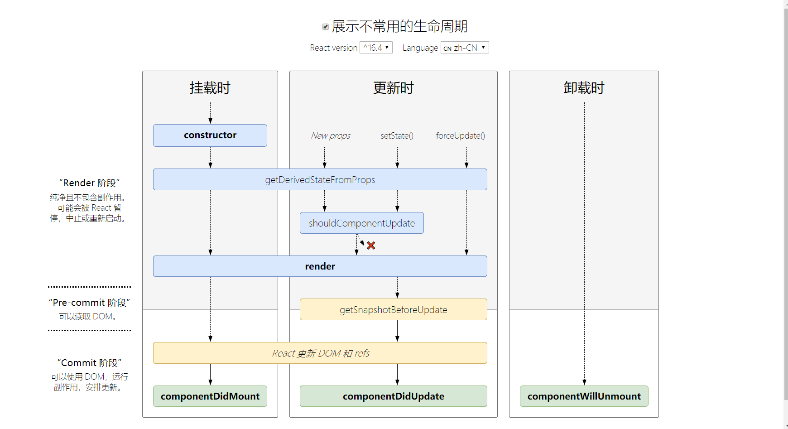

# React 中的生命周期

React 16 之后，有三个生命周期将被废弃(但并未删除)

- componentWillMount
- componentWillReceiveProps
- componentWillUpdate

代替的，新增了两个新的生命周期函数

- getDerivedStateFromProps
- getSnapshotBeforeUpdate

官方计划在 React 17 版本中完全删除上述三个函数，只保留 UNSAVE_前缀的三个函数，目的是为了向下兼容，但是对于开发者而言，应该尽量避免使用它们，而是使用新增的生命周期代替它们。

目前 React 16.8+ 的生命周期分为三个阶段，分别是挂载阶段、更新阶段、卸载阶段。

## 挂载阶段

- **constructor**：构造函数，最先被执行，我们通常在构造函数中进行初始化`state`对象或者给自定义方法绑定`this`。
- **getDerivedStateFromProps**：`static getDerivedStateFromProps(nextProps,prevState)`，这是一个静态方法，当我们接收到新的属性想要修改`state`时，可以使用`getDerivedStateFromProps`
- **render**：`render`函数是一个纯函数，只返回需要渲染的视图，不应该包含其他的业务逻辑，可以返回原生的`DOM`、`React`组件、`Fragment`、`Portals`、字符串和数字、`Boolean`和`null`等内容
- **componentDidMount**：组件装载之后调用，此时我们可以获取到`DOM`节点并操作，比如对`canvas`、`svg`的操作、服务器请求、订阅都可以写在该生命周期中，但要记得在`componentWillUnmount`中取消订阅。

## 更新阶段

- **getDerivedStateFromProps**：此方法在整个更新挂载阶段都可以能会被调用。
- **shouldComponentUpdate**：`shouldComponentUpdate(nextProps,nextState)`，有两个参数`nextProps`和`nextState`，表示新的属性和变化之后的`state`，返回一个布尔值，`true`表示会触发重新渲染，`false`表示不会触发重新渲染，默认返回`true`，通常我们利用该生命周期来优化`React`程序性能。
- **render**：更新阶段也会触发该生命周期。
- **getSnapshotBeforeUpdate**：`getSnapshotBeforeUpdate(prevProps,prevState)`，这个方法在`render`之后，`componentDidUpdate`之前调用，有两个参数`prevProps`和`prevState`，表示之前的属性和之前的`state`，这个函数有一个返回值，会作为第三个参数传给`componentDidUpdate`，如果不想要返回值，可以返回`null`，该生命周期必须与`componentDidUpdate`搭配使用。
- **componentDidUpdate**：`componentDidUpdate(prevProps,prevState,snapshot)`，该方法在`snapshot`，表示之前的`props`，之前的`state`和`snapshot`。第三个参数时`getSnapshotBeforeUpdate`返回的，如果触发某些回调函数时需要用到`DOM`元素的状态，则将对比或计算的过程迁移至`getSnapshotBeforeUpdate`，然后在`componentDidUpdate`中统一触发回调或更新状态。

## 卸载阶段

- **componentWillUnmount**：当我们的组件被卸载或者销毁了就会被调用，我们可以在该函数中清除全局定时器，取消网络请求，清理无效`DOM`元素等垃圾清理工作。

> 一个查看react生命周期的[网站](https://link.juejin.im/?target=http%3A%2F%2Fprojects.wojtekmaj.pl%2Freact-lifecycle-methods-diagram%2F)

