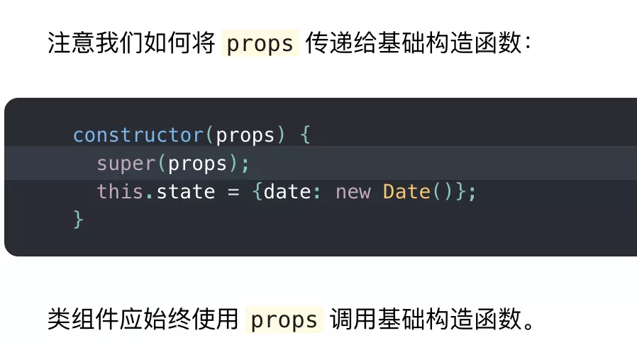

# 新手学习 React 易迷惑的点

网络上言论多是 React 上手比 Vue 难，可能难就难在无法深刻理解 JSX，或者对 ES6 的一些特性理解得不够深刻，导致觉得有些难以理解，然后说 React 比较难上手，所以针对 React 解释一些令人迷惑的知识点。

## 为什么要引入 React

在写 React 组件的时候，你经常会写过类似下面这样的代码：

```js
import React from 'react'

function Comp() {
    // ...code
    return (<div>123</div>)
}
```

你肯定会有这样的疑惑，上面的代码根本没有用到 React ，为什么还要引入 React 呢？

如果你将`import React from 'react'`删除掉，还会报如下错误：


那么究竟是哪里用到了 React 了呢？导致我们不引入 React 就会报错，如果不理解这个问题，那就是不理解 JSX 的工作原理。

你可以将上述代码（忽略导入语句）放到[在线babel](https://www.babeljs.cn/repl)里进行转化，发现 babel 会将上述代码转化为：

```js
function Comp () {
    // ...code 
    return React.createElement("div",null,"123")
}
```

因为从本质上来说，JSX 只是为 `React.createElement(component, props, ...children)`函数提供的语法糖。

## 为什么要用 className 而不用 class

1. React 一开始的理念是想与浏览器的 DOM API 保持一致，而不是 HTML，因为 JSX 是 JS 的扩展，而不是用来替代 HTML 的，这样会和 元素的创建更为接近。在元素上设置`class`需要使用`className`这个API:

   ```js
   const element = document.createElement("div")
   element.className = "hello"
   ```

2. 浏览器问题，ES5 之前，在对象中不能使用保留字。以下代码在 IE8 中会抛出错误：

   ```js
   const element = {
   	attributes: {
           class: "hello"
       }
   }
   ```

3. 解构问题，当你在解构属性的时候，如果分配了一个`class`变量会出问题：

   ```js
   const { class } = { class: 'foo' } // Uncaught SyntaxError: Unexpected token
   const { className } = { className: 'foo' }
   const { class: className } = { class: 'foo' }
   ```

## 为什么属性要用小驼峰

因为 JSX 语法上更接近与 JavaScript 而不是 HTML，因此 React DOM 使用`camelCase`（小驼峰命名）来定义属性的名称，而不是使用 HTML 属性名称的命名约定。

## 为什么 constructor 里要调用 super 和传递 props

这是官网上的一段代码：

```js
class Clock extends React.Component {
    constructor(super) {
        super(props)
        this.state = {
            date: new Date()
        }
    }
    render () {
        return {
            <div>
            	<h1>Hello,world!</h1>
            	<h2>It is {this.state.date.toLocaleTimeString()}.</h2>
            </div>
        }
    }
}
```

下面由这样一段话，不仅让我们调用`super`还要把`props`传递进去，但是并没有告诉我们为什么要这么做。



那么你有没有疑惑过为什么我们要调用`super`和传递`props`。

### 为什么要调用 super

其实这并不是 React 的限制，而是 JavaScript 的限制，在构造函数里如果要调用 this ，那么前提就是要优先调用 super，在 React 里，我们常常会在构造函数中初始化 state ，`this.state = xxx`，所以需要调用 super。

### 为什么要传递 props

```js
class Comp {
    constructor(props) {
		this.props = props;
        /// ...
    }
}
```

不过，如果你不小心漏传了`props`，直接调用了`super()`，你仍然可以在`render`和其他方法中访问`this.props`。

为什么这样也行？因为__React 在构造函数被调用之后，会把 props 赋值给刚刚创建的实例对象：__

```js
const instance = new NewComp(props)
instance.props = props
```

`props`不传也能用，是有原因的。

但这就意味着你在使用 React 时， 可以用`super()`代替`super(props)`了吗？

恐怕不行，不然官网也不会建议你调用 props 了，虽然 React 会在构造函数运行之后，为`this.props`赋值，但是在`super()`调用之后与构造函数结束之前，`this.props`仍然时没办法使用的。

```js
// Inside React
class Component {
    constructor(props) {
        this.props = props;
        // ...
    }
}
// Inside your code
class Button extends React.Component {
    constructor(props) {
        super() //😬 props
        console.log(props) //✅ {}
        console.log(this.props) //😬 undefined
    }
    // ...
}
```

要是构造函数中调用了某个访问`props`的方法，那这个 bug 就更定位了。__因此强烈建议始终使用super(props)，即便这并不是必需的__:

```js
class Button extends React.Component {
    constructor(props) {
        super(props) // ✅ We passed props
        console.log(props) // ✅ {}
        console.log(this.props) // ✅ {}
    }
    // ...
}
```

上面的代码确保`this.props`始终是有值的。

如果你想避免以上的问题，你可以通过[class 属性提案](https://github.com/tc39/proposal-class-fields)来简化代码：

```js
class Clock extends React.Component {
    state = {
        date: new Date()
    }
	render () {
        return (
        	<div>
            	<h1>Hello World!</h1>
            	<h2>It is {this.state.date.toLocaleTimeString()}.</h2>
            </div>
        )
    }
}
```

## 为什么组件用大写开头

前面提到， JSX 是`React.createElement(component,props,...children)`提供的语法糖，component 的类型是： `string/ReactClass type`，接下来具体看一下，什么情况下会用到`string`类型，什么情况下会用到`ReactClass type`类型：

- string 类型 React 会认为它是一个原生的 DOM 节点
- ReactClass type 类型 自定义组件

例如（string）：在 JSX 中我们写入：

```html
<div></div>
```

转变为 JS 的时候就变成了：

```js
React.createElement('div',null)
```

例如（ReactClass type）： 在 JSX 中我们写入：

```js
function MyDiv() {
    return (<div></div>)
}
<MyDiv />
```

转换成 JS 的时候就变成了：

```js
function MyDiv () {
    return React.createElement('div',null)
}
React.createElement(MyDiv, null)
```

如上的例子如果将 MyDiv 中的首字母改为小写，如下：

```js
function myDiv () {
    return (<div></div>)
}
<myDiv />
```

转换为 JS 的时候就变成了：

```js
function MyDiv () {
    return React.createElement('div',null)
}
React.createElement('myDiv',null)
```

由于获取不到 myDiv DOM节点，因此会发生错误。

## 原文链接

[新手学习 react 迷惑的点(一)](https://juejin.im/post/5d6be5c95188255aee7aa4e0)