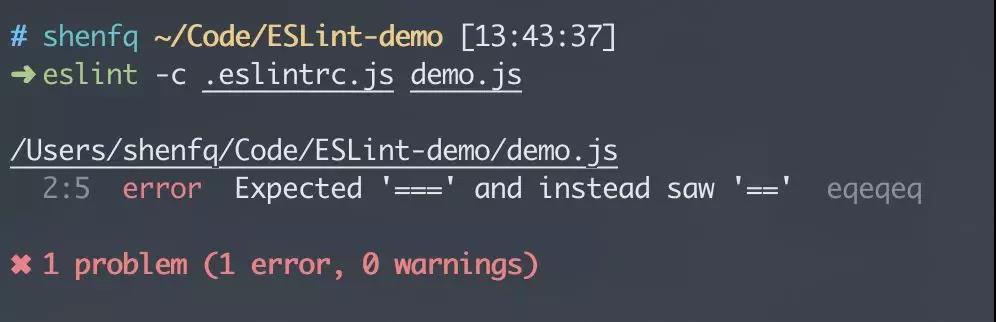

# 深入理解 ESLint

> 小沈是一个刚刚开始工作的前端实习生，第一次进行团队开发， 难免有些紧张。在导师的安排下，拿到了项目的git权限，开始进行clone。
>
> ```
> $ git clone git@github.com:company/project.git
> ```
>
> 小沈开始细细品味着同事们的代码，终于在他的不懈努力下，发现了老王两年前写的一个bug，跟导师报备之后，小沈开始着手修改。年轻人嘛，容易冲动，不仅修复了老王的bug，而且还把这部分代码进行了重构，使用了前两天刚刚在书中学会的策略模式，去掉了一些不必要的if-else逻辑。小沈潇洒的摸了摸自己稀疏的头发，得意地准备提交代码，想着第一天来到公司就秀了下自己超强的编码能力。接下来，可怕的事情发生了，代码死活不能通过lint工具的检测，急得他面红耳赤，赶紧跑去问导师，导师告诉他，只要按照控制台的warning修改代码就好了。小沈反驳道，这个lint工具非要我去掉分号，我在学校的时候，老师就教我分号是必不可少的，没有分号的代码是不完美的。导师无奈的笑了笑，打开了小沈的实习评分表，在团队合作项中勾选了【较差】。
>
> 不服气的小沈，写了一篇博客发布到了CSDN上，还收获了不少阅读量。
>
> 
>
> **问：工作第一天小沈犯了那些错误？**
>
> - 对不了解的业务代码进行重构，这是业务开发的大忌；
> - 没有遵守团队规范，团队开发带有较强的个人情绪。
>
> 当然，上述故事都是编的，接下来引入正题。

## Lint 工具简史

> 在计算机科学中，lint 是一种工具的名字，它用来标记代码中，某些可疑的、不具结构性(可能造成 bug)的语句。它是一种静态程序分析工具，最早适用于 C 语言，在 Unix 平台下开发出来的。后来它成为通用术语，可用于描述在任何一种编程语言中，用来标记代码中有疑义语句的工具。—— by wikipedia

在 JavaScript 20 多年的发展历程中，也出现过许许多多的 lint 工具，下面就来介绍下主流的三款 lint 工具。

- 1. JSLint
- 2. JSHint
- 3. ESLint


## JSLint


JSLint 可以说是最早出现的 JavaScript 的 lint 工具，由 Douglas Crockford(《JavaScript 语言精粹》作者)开发。从《JavaScript 语言精粹》的笔风就可以看出，Douglas 是一个眼里容不得瑕疵的人，所以 JSLint 也继承了这个特色，JSLint 的所有规则都是由 Douglas 自己定义的，可以说这是一个极具 Douglas 个人风格的 lint 工具，如果你要使用它，就必须接收它所有规则。值得称赞的是，JSLint 依然在更新，而且也提供了 node 版本：node-jslint。

## JSHint


由于 JSLint 让很多人无法忍受它的规则，感觉受到了压迫，所以 Anton Kovalyov(现在 Medium 工作)基于 JSLint 开发了 JSHint。JSHint 在 JSLint 的基础上提供了丰富的配置项，给了开发者极大的自由，JSHint 一开始就保持着开源软件的风格，由社区进行驱动，发展十分迅速。早期 JQuery 也是使用 JSHint 进行代码检查的，不过现在已经转移到了 ESLint 了。

## ESLint

												

ESLint 由 Nicholas C.Zakas(《JavaScript 高级程序设计》作者)于2013年6月创建，它的出现因为 Zakas 想使用 JSHint 添加一条自定义的规则，但是发现 JSHint 不支持，于是自己开发了一个。

ESLint 号称下一代的 JS Linter 工具，它的灵感来源于 PHP Linter，将源代码解析成 AST，然后检测 AST 来判断代码是否符合规则。ESLint 使用 esprima 将源代码解析成 AST，然后你就可以使用任意规则来检测 AST 是否符合预期，这也是 ESLint 高可扩展性的原因。

**早期源码**

```js
var ast = esprima.parse(text,{loc:true,range:true}),
    walk = astw(ast)
walk(function(node){
    api.emit(node.type,node)
})
return messages
```

但是，那个时候 ESLint 并没有大火，因为需要将源代码转成 AST，运行速度上输给了 JSHint，并且 JSHint 当时已经有完善的生态(编辑器的支持)。真正让 ESLint 大火是因为 ES6 的出现。

ES6 发布后，因为新增了很多语法，JSHint 短期内无法提供支持，而 ESLint 只需要有合适的解析器就可以进行 lint 检查。这时 babel 为 ESLint 提供了支持，开发了 babel-eslint，让 ESLint 成为了最快支持 ES6 语法的 lint 工具。


在 2016 年， ESLint 整合了与它同时诞生的另一个 lint 工具：JSCS，因为它与 ESLint 俱有异曲同工之妙，都是通过生成 AST 的方式进行规则检测。


自此，ESLint 在 JS Linter 领域一统江湖，成为了前端界的主流工具。

## Lint 工具的意义

下面一起来思考一个问题：Lint 工具对于工程师们来说到底是代码质量的保证还是一种束缚？

然后，我们在看看 ESLint 官网的简介：

> 代码检查是一种静态分析，常用于寻找有问题的模式或者代码，并且不依赖于具体的编码风格。对大多数编程语言来说，都会有代码检查，一般来说编译程序会内置检查工具。
>
> JavaScript 是一个动态的弱类型语言，在开发过程中比较容易出错。因为没有编译程序，为了寻找 JavaScript 代码的错误通常需要在执行过程中不断的调试。像 ESLint 这样的可以让程序员编码的过程中及时地发现问题而不是在执行过程中。

因为 JavaScript 这门神奇的语言，在带给我们灵活性的同时，也埋下了一些坑。比如 == 涉及到的弱类型转换，着实让人们很苦恼，还有 this 的指向问题，也是一个让人迷惑的东西。而 Lint 工具就很好的解决了这个问题。干脆禁止你使用 == ，这种做法虽然限制了语言的灵活性，但是带来的收益也是可观的。

还有就是作为一门动态语言，因为缺少编译过程，有些本可以在编译过程中发现的错误，只能等到运行时才能发现，这给我我们的调试工作增加了一定的负担，而 Lint 工具相当于为语言增加了编译过程，在代码运行前进行静态分析找到出错的地方。

所以汇总一下，Lint 工具的优势：

- 1.避免低级 bug，找出可能发生的语法错误。使用未声明变量，修改 const 变量 ...
- 2.提示删除多余的代码。声明而未使用的变量、重复的 case...
- 3.确保代码遵循最佳实践。可参考 aribnb style、JavaScript standard
- 4.统一团队的代码风格。如：加不加分号？使用 tab 还是 空格？

## 使用方式

说了这么多，还是来看一下有实际意义的，ESLint 到底如何使用。

**初始化**

如果想要在现有项目中引入 ESLint，可以直接运行下面的命令：

```js
# 全局安装 ESLint
$ npm install -g eslint / yarn add -global eslint

# 进入项目
$ cd ~/Code/ESLint-demo

# 初始化 package.json
$ npm init -f / yarn 

# 初始化 ESLint 配置
$ eslint --init
```


在使用 eslint --init 后，会出现很多的用户配置项，具体可以参考： eslint cli 部分源码。

经过一系列一问一答环节后，你会发现在你的文件夹的根目录下生成了一个 .eslintrc.js 文件。


## 配置方式

ESLint 一共有两种配置方式：

1. 使用注释把 lint 规则直接嵌入到源代码中

   这是最简单粗暴的方式，直接在源代码中使用 ESLint 能够识别的注释方式，进行 lint 规则的定义。

   ```js
   /* eslint eqeqeq:'error'*/
   var num = 1
   num == '1'
   ```

   当然我们一般使用注释是为了临时禁止某些严格的 lint 规则出现的警告：

   ```js
   /* eslint-disable */
   alert('该注释放在文件顶部，整个文件都不会出现 lint 警告')/* eslint-enable */
   alert('重新启用 lint 告警')/* eslint-disable eqeqeq */
   alert('只禁止某一个或多个规则')/* eslint-disable-next-line */
   alert('当前行禁止 lint 警告')
   
   alert('当前行禁止 lint 警告') // eslint-disable-line
   ```

2. 使用配置文件的方式进行 lint 规则的配置

   在初始化过程中，有一个选项就是使用什么文件类型进行 lint 配置(What format do you want your config file to be in ?)：

   ```js
   {
       title: 'list',
       name: 'format',
       message: 'What format do you want your config file to be in ?',
       default: 'JavaScript',
       choices: ['JavaScript','YAML','JSON']
   }
   ```

   官方一共提供了三个选项：

   - JavaScript(eslintrc.js)
   - YAML(eslint.yaml)
   - JSON(eslint.json)

   另外，你也可以自己在 package.json 文件中添加 eslintConfig 字段进行配置。

   翻阅 ESLint 源码可以看到，其配置文件的优先级如下： 

   ```js
   const configFilenames = {
       '.eslintrc.js',
       '.eslintrc.yaml',
       '.eslintrc.yml',
       'eslintrc.json',
       'eslintrc',
       'package.json'
   }
   ```

   ```
   .eslintrc.js > .eslintrc.yaml > .eslintrc.yml > .eslintrc.json > .eslintrc > package.json
   ```

   当然你也可以使用 cli 自己制定配置文件路径：



**项目级与目录级的配置**

我们有如下目录结构，此时在根目录运行 ESLint，那么我们将得到两个配置文件 .eslintrc.js(项目级配置)和 src/.eslintrc.js(目录级配置)，这两个配置文件会进行合并，但是 src/.eslintrc.js 具有更高的优先级。


但是，我们只要在 src/.eslintrc.js 中配置 `'root':true`，那么 ESLint 就会认为 src 目录为根目录，不再向上查找配置。

```js
{
    'root':true
}
```

## 配置参数

下面我们一起来细细品味 ESLint 的配置规则。

**解析器配置**

```js
{
  // 解析器类型
  // espima(默认), babel-eslint, @typescript-eslint/parse
  "parse": "esprima",
  // 解析器配置参数
  "parseOptions": {
    // 代码类型：script(默认), module
    "sourceType": "script",
    // es 版本号，默认为 5，也可以是用年份，比如 2015 (同 6)
    "ecamVersion": 6,
    // es 特性配置
    "ecmaFeatures": {
        "globalReturn": true, // 允许在全局作用域下使用 return 语句
        "impliedStrict": true, // 启用全局 strict mode
        "jsx": true // 启用 JSX
    },
  }}
```

对于 @typescript-eslint/parse 这个解析器，主要是为了替代之前存在的 TSLint，TS 团队因为 ESLint 生态的繁荣，且 ESLint 具有更多的配置项，不得不抛弃 TSLint 转而实现一个 ESLint 的解析器。同时，该解析器拥有 `<a  href="https://www.npmjs.com/package/@typescript-eslint/parser#configuration">`不同的配置：

```js
{
  "parserOptions": {
    "ecmaFeatures": {
      "jsx": true
    },
    "useJSXTextNode": true,
    "project": "./tsconfig.json",
    "tsconfigRootDir": "../../",
    "extraFileExtensions": [".vue"]
  }}
```

**环境与全局变量**

ESLint 会检测未声明的变量，并发出警告，但是有些变量是我们引入的库声明的，这里就需要提前再配置中声明。

```js
{
  "globals": {
    // 声明 jQuery 对象为全局变量
    "$": false // true表示该变量为 writeable，而 false 表示 readonly
  }}
```

在 globals 中一个个的声明未免有点繁琐，这个时候就需要使用到 env，这是对一个环境定义的一组全局变量的预设(类似于 babel 的 presets)。

```js
{
  "env": {
    "amd": true,
    "commonjs": true,
    "jquery": true
  }
}
```

可选的环境很多，预设值都在这个文件中进行定义，查看源码可以发现，其预设变量都引用自 globals 包。


## 规则设置

ESLint 附带有大量的规则，你可以在配置文件的 rules 属性中配置你想要的规则。每一条规则接受一个参数，参数的值如下：

- 'off' 或 0：关闭规则
- 'warn' 或 1：开启规则，warn 级别的错误(不会导致程序退出)
- 'error' 或 2：开启规则，error 级别的错误(当被触发的时候，程序会退出)

举个例子，我们先写一段使用了平等(equality)的代码，然后对 eqeqeq 规则分别进行不同的配置。

```js
// demo.js
var num = 1
num == '1'
```


这里使用了命令行的配置方式，如果你只想对单个文件进行某个规则的校验就可以使用这种方式。

但是，事情往往没有我们想象中那么简单，ESLint 的规则不仅只有关闭和开启这么简单，每一条规则还有自己的配置项。如果需要对某一个规则进行配置，就需要使用数组形式的参数。

我们来看下 quotes 的规则，根据官网介绍，它支持字符串和对象两个配置。


```js
{
  "rules": {
    // 使用数组形式，对规则进行配置
    // 第一个参数为是否启用规则
    // 后面的参数才是规则的配置项
    "quotes": [
      "error",
      "single",
      {
        "avoidEscape": true 
      }
    ]
  }
}
```

根据上面的规则：

```js
// bad
var str = "test 'ESLint' rule"
// good
var str = 'test "ESLint" rule'
```

## 扩展

扩展就是直接使用别人已经写好的 lint 规则，方便快捷。扩展一般支持三种类型:

```js
{
    'extends':[
        'eslint:recommended',
        'plugin:react/recommended',
        'eslint-config-standard'
    ]
}
```

- eslint：开头的是 ESLint 官方的扩展，一共有两个：eslint：recommended、eslint：all。
- plugin：开头的是扩展插件类型，也可以直接在 plugins 属性中进行设置，后面一节会详细讲到。
- 最后一种扩展来自 npm 包，官方规定 npm 包的扩展必须以 eslint-config- 开头，使用时可以省略这个头，上面案例中 eslint-config-standard 可以直接简写成 standard。

如果你觉得自己的配置十分满意，也可以将自己的 lint 配置发布到 npm 包，只要将包名命名为 eslint-config-xxx 即可，同时，需要在 package.json 的 peerDependencies 字段中声明你依赖的 ESLint 的版本号。

## 插件

**使用插件**

虽然官方提供了上百种的规则可供选择，但是这还不够，因为官方的规则只能检查标准的 JavaScript 语法，如果你写的是 JSX 或者 Vue 单文件组件，ESLint 的规则就开始束手无策了。

这个时候就需要安装 ESLint 的插件，来定制一些特定的规则进行检查。ESLint 的插件与扩展一样有固定的命名格式，以 eslint-plugin- 开头，使用的时候也可以省略掉这个头。

```js
npm install --save-dev eslint-plugin-vue eslint-plugin-react
```

```js
{
    'plugin':[
        'react', // eslint-plugin-react
        'vue', // eslint-plugin-vue
    ]
}
```

或者是在扩展中引入插件，前面有提到 plugin：开头的是扩展，可进行插件的加载。

```js
{
    'extends':[
        'plugin:react/recommended',
    ]
}
```

通过扩展的方式加载插件的规则如下：

```js
extPlugin = `plugin:${pluginName}/${configName}`
```

对照上面的案例，插件名(pluginName)为 react，也就是之前安装的 eslint-plugin-react 包，配置名(configName)为 recommended。那么这个配置名又是从何而来呢？

可以看到 eslint-plugin-react 的源码。

```js
module.exports = {
    // 自定义的 rules
    rules: allRules,
    // 可用的扩展
    configs:{
        // plugin:react/recommended
        recommended:{
            plugins:['react'],
            rules:{...}
        },
        // plugin:react/all
        all:{
            plugin: ['react'],
            rules:{...}
        }
    }
}
```

配置名是插件配置的 configs 属性定义的，这里的配置其实就是 ESLint 的扩展，通过这种方式既可以加载插件，又可以加载扩展。

**开发插件**

ESLint 官方为了方便开发者，提供了 Yeoman 的模板(generator-eslint)。

```js
# 安装模块
npm install -g you generator-eslint

# 创建目录
mkdir eslint-plugin-demo
cd eslint-plugin-demo

# 创建模板
yo eslint:plugin
```


创建好项目之后，就可以开始创建一条规则了，幸运的是 generator-eslint 除了能够生成插件的模板代码外，还具有创建规则的模板代码。打开之前创建的 eslint-plugin-demo 文件夹，在该目录下添加一条规则，我们希望这条规则能够检测出我的代码中是否有 console，所以，我给该规则明明为 disable-console。

```js
yo eslint:rule
```


接下来我们看看如何来制定 ESLint 的一个规则：

打开 `lib/rules/disable-console.js`，可以看到默认的模板代码如下：

```js
module.export = {
    meta: {
        docs: {
            description: 'disable console',
            category: 'Fill me in',
            recommended: false
        },
        schema: []
    },
    create: function (context) {
        // variables should be defined here
        return {
            // give me methods
        }
    }
}
```

简单的介绍下其中的参数(更详细的介绍可以查看官方文档):

- meta：规则的一些描述信息
  - description(string)：规则的简短描述
  - category(string)：规则的类别(具体类别可以查看官网)
  - recommended(boolean)：是否加入 eslint:recommended
  - docs：规则的描述对象
  - schema(array)：规则所接受的配置项
- create：返回一个对象，该对象包含 ESLint 在遍历 JavaScript 代码 AST 时，所触发的一系列事件钩子。

在详细讲解如何创建一个规则之前，我们先来谈谈 AST(抽象语法树)。ESLint 使用了一个叫做 Espree 的 JavaScript 解析器来把 JavaScript 代码解析成为一个 AST 。然后进行深度遍历 AST，每条规则都会对匹配的过程进行监听，每当匹配到一个类型，相应的规则就会进行检查。为了方便查看 AST 的各个节点类型，这里提供了一个网站能十分清晰的查看一段代码解析成 AST 之后的样子：astexplorer。如果你想找到所有 AST 节点的类型，可以查看 estree。


可以看到 console.log() 属于 ExpressionStatement(表达式语句) 中的 CallExpression(调用语句)。

```js
{
  "type": "ExpressionStatement",
  "expression": {
    "type": "CallExpression",
    "callee": {
      "type": "MemberExpression",
      "object": {
        "type": "Identifier",
        "name": "console"
      },
      "property": {
        "type": "Identifier",
        "name": "log"
      },
      "computed": false
    }
  }
}
```

所以，我们要判断代码中是否调用了 console，可以在 create 方法返回的对象中，写一个 CallExpression 方法，在 ESLint 遍历 AST 的过程中，对调用语句进行监听，然后检查该调用语句是否为 console 调用。

```js
module.exports = {
    create: function(context) {
        return {
            CallExpression(node) {
                // 获取调用语句的调用对象
                const callObj = node.callee.object
                if(!callObj) return 
                if(callObj.name === 'console') {
                    // 如果调用对象为 console，通知 ESLint
                    context.report({
                        node,
                        message: 'error:should remove console'
                    })
                }
            }
        }
    }
}
```

可以看到我们最后通过 context.report 方法，告诉 ESLint 这是一段有问题的代码，具体要怎么处理，就要看 ESLint 配置中，该条规则是 ['off','warn','error']中的哪一种了。

之前介绍规则的时候，有讲到规则是可以接受配置的，下面看看我们自己制定规则的时候，要如何接受配置项。其实很简单，只需要在 meta 对象的 schema 中定义好参数的类型，然后在 create 方法中，通过 context.options 获取即可。下面对 disable-console 进行修改，毕竟禁止所有的 console 太过于严格，我们可以添加一个参数，该参数是一个数组，表示允许调用的 console 方法。

```js
module.exports = {
    meta: {
        docs: {
            description: 'disable console', // 规则描述
            category: 'Possible Errors', // 规则类别
            recommended: false
        },
        schema: [
            // 接受一个参数
            {
                type: 'array', // 接收参数类型为数组
                items: {
                    type: 'string' // 数组的每一项为一个字符串
                }
            }
        ]
    },
    
    create: function(context) {
        const logs = [
            // console 的所有方法
            'debug','error','info','log','warn',
            'dir','dirxml','table','trace',
             'group', 'groupCollapsed', 'groupEnd', 
             'clear', 'count', 'countReset', 'assert', 
             'profile', 'profileEnd', 
             'time', 'timeLog', 'timeEnd', 'timeStamp', 
             'context', 'memory'
        ]
        return {
            CallExpression(node) {
                // 接受的参数
                const allowLogs = context.options[0]
                const disableLogs = Array.isArray(allowLogs)
                // 过滤掉允许调用的方法
                ? logs.filter(log => !allowLogs.includes(log))
                : logs
               	const callObj = node.callee.object
                const callProp = node.callee.property
                if(!callObj || !callProp) return 
                if(callObj.name !== 'console') return 
                // 检测掉不允许调用的 console 方法
                if(disableLogs.includes(callProp.name)){
                    context.report({
                        node,
                        message: 'error: should remove console'
                    })
                }
            }
        }
    }
}
```

规则写完之后，打开`tests/rules/disable-console.js`,编写测试用例。

```js
const rule = require('lib/rules/disable-console')
let RuleTester = require('eslint').RuleTester
let ruleTester = new RuleTester()
ruleTester.run('disable-console',rule,{
    valid: [{
        code: 'console.info(test)',
        options: [{'info'}]
    }],
    invalid: [{
        code: 'console.log(test)',
        errors: [{
            message: 'error: should remove console'
        }]
    }]
})
```


最后，只需要引入插件，然后开启规则即可。

```js
// eslint.js
module.exports = {
    plugins: ['demo'],
    rules: {
        'demo/disable-console':[
            'error',
            ['info']
        ]
    }
}
```


## 最佳配置


业界有许多 JavaScript 的推荐编码规范，较为出名的就是下面两个：

1. aribnb style
2. JavaScript standard

同时，这里也推荐 Alloy Team 的 eslint-config-alloy。

但是代码规范这个东西，最好是团队成员之间一起来制定，确保大家都能够接受，如果实在是有人有异议，就只能少数服从多数了。虽然这节的标题叫做最佳配置，但是软件行业并没有什么方案是最佳方案，即便 JavaScript standard 也不是 JavaScript 标准的编码规范，它仅仅只是叫这个名字而已，只有适合的才是最好的。

最后安利一下，将 ESLint 和 Prettier 搭配使用，不仅可以统一编码规范，也能统一代码风格。

## 总结

看到这里我们做一下总结。

JavaScript 的 linter 工具发展历史其实也不算短，ESLint 之所以能够后来者居上，主要原因还是 JSLint 和 JSHint 采用自顶向下的方式来解析代码，并且早期 JavaScript 语法万年不更新，通过这种方式以较快的速度解析代码，找到可能存在的语法错误和不规范的代码。但是自 ES6 发布以后，JavaScript 语法发生了很多的改动，比如：箭头函数、模板字符串、扩展运算符...，这些语法的发布，导致 JSLint 和 JSHint 如果不更新解析器就没办法检测 ES6 的代码。而 ESLint 另辟蹊径，采用 AST 的方式对代码进行静态分析，并保留了强大的可扩展性和灵活的配置能力。这也告诉我们，在日常的开发中，一定要考虑到后续的扩展能力。

正是因为这种强大的扩展能力，让业界的很多 JavaScript 编码规范能够在各个团队快速的落地，并且团队自己定制的代码规范也可以对外共享。

最后，希望你通过以上知识的学习，能够理解 ESLint 所带来的巨大好处，同时掌握了 ESLint 的用法，并可以为现有的项目引入 ESLint 改善项目的代码质量。

## 原文链接

[深入理解 ESLint](https://segmentfault.com/a/1190000019896962)