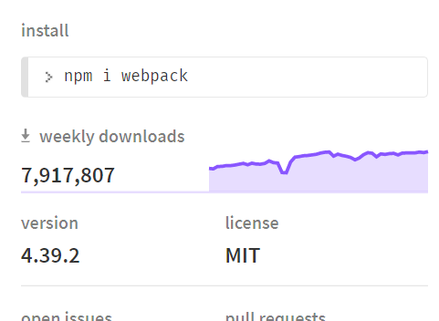

# 从 Webpack 到 Rollup

> 2017年4月份，Facebook 将 React 的构建工具换成了 Rollup。这一举动，使得一些人非常疑惑：“WebPack不也是由Facebook开发的吗？为什么它们会选用 Rollup 而抛弃 WebPack？”

这是一个完全合理的问题。WebPack自诞生之初就备受注目，可以算是现代 JavaScript 社区最成功的故事之一，每月有着几百万的下载量，为成千上万的网站及应用提供技术支持。它拥有活跃的社区，庞大的生态系统，众多的贡献者，而且作为一个社区开源项目，还有一个有意义的财务支持。



[^]: 到目前为止，webpack下载量近八百万

相比之下，Rollup 并不起眼。但我们会发现，包括 React 在内的大型 JavaScript 库都在使用着 Rollup，如：Vue，Ember，Three.js，Moment以及其他一些知名的库。

那么，为什么这些知名的库纷纷抛弃 WebPack，转投入 Rollup 的怀抱呢？

## WebPack

[WebPack](https://webpack.github.io/) 诞生于 2012 年，由 Tobias Koppers 发起，用于解决当时现有工具未解决的一个难题：构建复杂的单页应用程序(SPA)。它时一个强力的模块打包器。所谓包(bundle)就是一个 JavaScript 文件，他把所有的资源(assets)整合在一起，以便于它们可以在同一个文件请求中发回给客户端。包中可以包含 JavaScript、CSS 样式、HTML 以及很多其他类型的文件。


### WebPack 的特点

- **代码分割(Code Splitting)**

  简单来说，就是将一个巨大的应用程序整体切割成一块一块的可管理的代码块，可以按需加载，当访问相应页面时再进行页面加载，这意味着可以更快速的获取交互性网站，而不必等到整个应用程序下载和解析完成。

- **静态资源(Static assets)**

  类似 image 和 CSS 文件导入到你的应用程序中，而且还可以被作为依赖图中的另一个节点。我们不需要再去关心文件是否放入正确的文件夹中，也不需要为文件 URL 添加 hash 而使用 hack 脚本，因为 WebPack 会帮助我们处理这些事情。

- **加载器(Loader)**

  WebPack 本身只能够处理原生的 JavaScript 模块，但是依托于 loader 转换器，可以帮助 WebPack 将各种类型的资源转换成 JavaScript 模块。这样，任何资源都可以成为 WebPack 可以处理的模块。

- **智能解析**

  WebPack 内部存在这一个智能解析器，几乎可以处理任何第三方库，无论他们的模块形式是 CommonJS、AMD还是普通的 JS 文件。甚至再加载依赖的时候，允许使用动态表达式 require('./templates/'+name+'.jade')。

- **插件系统**

  WebPack 内置了功能丰富的插件系统。大多数内容功能都是基于这个插件系统运行的，还可以开发和使用开源的 WebPack 插件，来满足各式各样的需求。

###  WebPack 的缺点

正是由于 WebPack 拥有如此强大的功能，使得它再进行资源打包的时候，会产生过多冗余的代码。

举个例子：把`export default str => str`这段代码用 WebPack 进行打包会得到如下的结果：

```js
/******/ (function(modules) { // webpackBootstrap
/******/    // The module cache
/******/    var installedModules = {};
/******/
/******/    // The require function
/******/    function __webpack_require__(moduleId) {
/******/
/******/        // Check if module is in cache
/******/        if(installedModules[moduleId]) {
/******/            return installedModules[moduleId].exports;
/******/        }
/******/        // Create a new module (and put it into the cache)
/******/        var module = installedModules[moduleId] = {
/******/            i: moduleId,
/******/            l: false,
/******/            exports: {}
/******/        };
/******/
/******/        // Execute the module function
/******/        modules[moduleId].call(module.exports, module, module.exports, __webpack_require__);
/******/
/******/        // Flag the module as loaded
/******/        module.l = true;
/******/
/******/        // Return the exports of the module
/******/        return module.exports;
/******/    }
/******/
/******/
/******/    // expose the modules object (__webpack_modules__)
/******/    __webpack_require__.m = modules;
/******/
/******/    // expose the module cache
/******/    __webpack_require__.c = installedModules;
/******/
/******/    // define getter function for harmony exports
/******/    __webpack_require__.d = function(exports, name, getter) {
/******/        if(!__webpack_require__.o(exports, name)) {
/******/            Object.defineProperty(exports, name, {
/******/                configurable: false,
/******/                enumerable: true,
/******/                get: getter
/******/            });
/******/        }
/******/    };
/******/
/******/    // getDefaultExport function for compatibility with non-harmony modules
/******/    __webpack_require__.n = function(module) {
/******/        var getter = module && module.__esModule ?
/******/            function getDefault() { return module['default']; } :
/******/            function getModuleExports() { return module; };
/******/        __webpack_require__.d(getter, 'a', getter);
/******/        return getter;
/******/    };
/******/
/******/    // Object.prototype.hasOwnProperty.call
/******/    __webpack_require__.o = function(object, property) { return Object.prototype.hasOwnProperty.call(object, property); };
/******/
/******/    // __webpack_public_path__
/******/    __webpack_require__.p = "";
/******/
/******/    // Load entry module and return exports
/******/    return __webpack_require__(__webpack_require__.s = 0);
/******/ })
/************************************************************************/
/******/ ([
/* 0 */
/***/ (function(module, __webpack_exports__, __webpack_require__) {

"use strict";
Object.defineProperty(__webpack_exports__, "__esModule", { value: true });

/* harmony default export */ __webpack_exports__["default"] = (str => str);


/***/ })
/******/ ]);
```

这在以下的一些情境中就不太高效了，需要寻求更好的解决方案：

- 需要 JavaScript 高效运行。由于 WebPack 对子模块定义和运行时的依赖处理(`__ webpack_require__)，不仅导致文件体积增大，还会大幅度拉低性能；
- 项目(特别是类库)只存在 JavaScript 文件，而没有其他的静态资源文件，使用 WebPack 有点大材小用了，因为 webpack bundle 文件的体积略大，运行略慢，可读性略低。

在上述情况下，就需要寻求一种更好的解决方案，这便是 Rollup 诞生的原因。

## Rollup

[Rollup](https://www.rollupjs.com/) 是下一代 JavaScript 模块打包工具。开发者可以在你的应用或库中使用 ES6 模块，然后高效地将它们打包成一个单一的文件用于浏览器和 Node.js 使用。Rollup 最令人激动的地方是，能够让打包文件体积很小。这么说可能很难理解，更详细的解释：相比于其他 JavaScript 打包工具，Rollup 总能打出更小，更快的包。因为 Rollup 基于 ES6 模块，比 WebPack 和 Browserify 使用的 CommonJS 模块机制更高效。这也让 Rollup从模块中删除无用代码，即 **tree-shaking** 更加容易。


### Rollup的特点

- **Tree-Shaking**

  这个特点，是 Rollup 最初推出时的一大特点。Rollup 通过对代码的静态分析，分析出冗余代码，在最终的打包文件中将这些冗余代码删除掉，进一步缩小打包文件的体积。这是目前大部分构建工具所不具备的特点(WebPack 2.0+ 开始支持Tree-Shaking，但由于文件类型庞杂，较 Rollup 稍显逊色)。

- **ES6 模块打包支持**

  该特点也是其他构建工具所不具备的。Rollup 直接不需要通过 babel 将 import 转换成 CommonJS 的 require 方式，极大的利用 ES6 模块的优势。

## WebPack 与 Rollup 对比

同样一段代码，分别用不同的打包工具进行打包。

```js
# 目录
|-- src/
    |-- index.js
    |-- prefix.js
    |-- suffix.js
    
# prefix.js
const prefix = 'prefix';
export default str => `${prefix} | ${str}`;
    
# suffix.js
const suffix = 'suffix';
export default str => `${str} | ${suffix}`;

# index.js
import prefix from './prefix';
import suffix from './suffix';

export default str => suffix(prefix(str));
```

```js
// webpack.bundle.js

(function webpackUniversalModuleDefinition(root, factory) {
    if(typeof exports === 'object' && typeof module === 'object')
        module.exports = factory();
    else if(typeof define === 'function' && define.amd)
        define([], factory);
    else if(typeof exports === 'object')
        exports["demo"] = factory();
    else
        root["demo"] = factory();
})(typeof self !== 'undefined' ? self : this, function() {
return /******/ (function(modules) { // webpackBootstrap
/******/    // The module cache
/******/    var installedModules = {};
/******/
/******/    // The require function
/******/    function __webpack_require__(moduleId) {
/******/
/******/        // Check if module is in cache
/******/        if(installedModules[moduleId]) {
/******/            return installedModules[moduleId].exports;
/******/        }
/******/        // Create a new module (and put it into the cache)
/******/        var module = installedModules[moduleId] = {
/******/            i: moduleId,
/******/            l: false,
/******/            exports: {}
/******/        };
/******/
/******/        // Execute the module function
/******/        modules[moduleId].call(module.exports, module, module.exports, __webpack_require__);
/******/
/******/        // Flag the module as loaded
/******/        module.l = true;
/******/
/******/        // Return the exports of the module
/******/        return module.exports;
/******/    }
/******/
/******/
/******/    // expose the modules object (__webpack_modules__)
/******/    __webpack_require__.m = modules;
/******/
/******/    // expose the module cache
/******/    __webpack_require__.c = installedModules;
/******/
/******/    // define getter function for harmony exports
/******/    __webpack_require__.d = function(exports, name, getter) {
/******/        if(!__webpack_require__.o(exports, name)) {
/******/            Object.defineProperty(exports, name, {
/******/                configurable: false,
/******/                enumerable: true,
/******/                get: getter
/******/            });
/******/        }
/******/    };
/******/
/******/    // getDefaultExport function for compatibility with non-harmony modules
/******/    __webpack_require__.n = function(module) {
/******/        var getter = module && module.__esModule ?
/******/            function getDefault() { return module['default']; } :
/******/            function getModuleExports() { return module; };
/******/        __webpack_require__.d(getter, 'a', getter);
/******/        return getter;
/******/    };
/******/
/******/    // Object.prototype.hasOwnProperty.call
/******/    __webpack_require__.o = function(object, property) { return Object.prototype.hasOwnProperty.call(object, property); };
/******/
/******/    // __webpack_public_path__
/******/    __webpack_require__.p = "";
/******/
/******/    // Load entry module and return exports
/******/    return __webpack_require__(__webpack_require__.s = 0);
/******/ })
/************************************************************************/
/******/ ([
/* 0 */
/***/ (function(module, __webpack_exports__, __webpack_require__) {

"use strict";
Object.defineProperty(__webpack_exports__, "__esModule", { value: true });
/* harmony import */ var __WEBPACK_IMPORTED_MODULE_0__prefix__ = __webpack_require__(1);
/* harmony import */ var __WEBPACK_IMPORTED_MODULE_1__suffix__ = __webpack_require__(2);


/* harmony default export */ __webpack_exports__["default"] = (str => Object(__WEBPACK_IMPORTED_MODULE_1__suffix__["a" /* default */])(Object(__WEBPACK_IMPORTED_MODULE_0__prefix__["a" /* default */])(str)));


/***/ }),
/* 1 */
/***/ (function(module, __webpack_exports__, __webpack_require__) {

"use strict";
const prefix = 'prefix';

/* harmony default export */ __webpack_exports__["a"] = (str => `${prefix} | ${str}`);


/***/ }),
/* 2 */
/***/ (function(module, __webpack_exports__, __webpack_require__) {

"use strict";
const suffix = 'suffix';

/* harmony default export */ __webpack_exports__["a"] = (str => `${str} | ${suffix}`);


/***/ })
/******/ ]);
});
```

```js
// rollup.bundle.js

(function (global, factory) {
    typeof exports === 'object' && typeof module !== 'undefined' ? module.exports = factory() :
    typeof define === 'function' && define.amd ? define(factory) :
    (global.demo = factory());
}(this, (function () { 'use strict';

    const prefix = 'prefix';

    var prefix$1 = str => `${prefix} | ${str}`;

    const suffix = 'suffix';

    var suffix$1 = str => `${str} | ${suffix}`;

    var index = str => suffix$1(prefix$1(str));

    return index;

})));
```

从上述打包的文件基本可以看出，Rollup 的优势在哪里了：

- 文件小，几乎没有多余的代码，除了必要的`cjs`，`umd`头外，bundle 代码基本与源代码差不多，也没有冗余的`__ webpack_require__`，`Object.definePropery`之类的代码；
- 执行速度快，由于没有了多余的代码，所以比之 WebPack ，Rollup 打包速度，构建速度更快。

## 如何选择

通过上述分别对 WebPack 和 Rollup 进行介绍，不难看出，WebPack 和 Rollup 在不同场景之下，都发挥着自身的优势，这种优势是彼此都不具备的。WebPack 对于代码分割和静态资源处理有着**先天优势**，并且支持热模块替换(HMR)，而 Rollup 并不支持，所以当用户项目需要用到以上功能时，则可以优先考虑 WebPack。但是，Rollup 对于代码的 Tree-Shaking和 ES6 模块上有着算法优势上的支持，如果你的项目只需要打包出一个简单的 bundle 包，并且是基于 ES6 模块开发的，那么选择 Rollup 就很有必要了。

其实，自 WebPack 2.0+ 开始支持 Tree-Shaking，并在使用`babel-loader`的情况下支持了 ES6 module 的打包之后，Rollup 已经逐渐失去了当初的优势。但是它并没有被抛弃，反而因为其简单的 API、使用方式而被广大的 JS 库开发者青睐，如：React、Vue 等，都在使用 Rollup 作为构建工具。而 WebPack 在中大型项目中使用非常广泛。

总而言之，用一句话概括：**在开发应用时使用 WebPack，开发库时使用 Rollup**

## 总结

WebPack 和 Rollup 作为构建工具，都拥有着各自的优势和使用场景，我们不能因为它们的一些缺点而弃之，相反，我们在开发过程中，如果能够利用好其优点，就会给我们的生产效率带来极大的提高。

## 参考链接

[Webpack vs Rollup](https://blog.csdn.net/wangyiyungw/article/details/84955909)

[Webpack 和 Rollup ：一样但又不同](https://www.html.cn/archives/7703)

[前端进阶（6） - webpack 之外的另一种选择：rollup](https://www.jianshu.com/p/0e462e43dfc5)