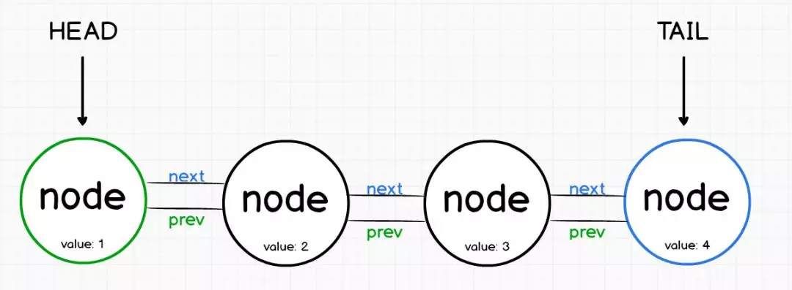
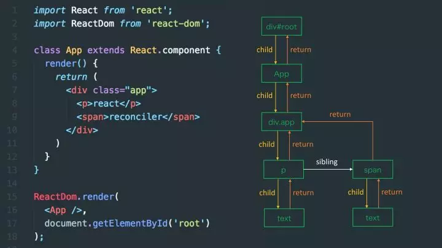
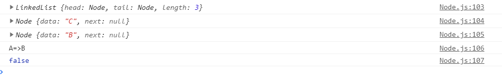

## 链表（Linked Lists）

与数组类似，链表是按顺序存储数据元素的。

不同的是，链表不保留索引，而是指向其他元素。



第一个节点称为头部`head`，而最后一个节点称为尾部`tail`。

**单链表与双向链表**

- 单链表是表示一系列节点的数据结构，其中每个节点指向列表中的下一个节点。
- 链表通常需要遍历整个操作列表，因此性能较差。
- 提高链表性能的一种方法是在每个节点上添加指向列表中上一个节点的第二个指针。
- 双向链表具有指向其前后元素的节点。

**链表的优点**

- 链表插入与删除元素的时间复杂度为**O(1)**，因为我们可以只更改指针。

- 与数组相同，链表可以作为堆栈运行。

**链表的应用场景**

链表在客户端和服务器中都很常用。

- 在客户端上，像`Redux`就以链表方式构建其中的逻辑。
- `React`核心算法`React Fiber`的实现就是链表。



- `React Fiber`之前的`Stack Reconciler`，是自顶向下的递归`mount/update`，无法中断（持续占用主线程），这样主线程中的布局、动画等周期性任务以及交互响应就无法立即得到处理，影响体验。
- `React Fiber`解决过去`Reconciler`存在的问题的思路是把渲染/更新过程（递归`diff`）拆分成一系列小任务，每次检查树上的一小部分，做完看是否还有时间继续下一个任务，有的话继续，没有的话将自己挂起，主线程不忙的时候再继续。
- 在服务器上，像`Express`这样的`Web`框架也以类似的方式构建其中间件逻辑。当请求被接收时，它从一个中间件管道输送到下一个，直到响应被发出。

### 单链表实现

单链表的操作核心有

> - push（value） 在链表的末尾/头部添加一个节点
> - pop（） 从链表的末尾/头部删除一个节点
> - get（index）返回指定索引出的节点
> - delete（index）删除指定索引处的节点
> - isEmpty（）根据列表长度返回 true 或 false
> - print（）返回链表

代码实现：

```js
// 节点
class Node {
    constructor(value) {
        this.value = value
        this.next = null
    }
}
```

```js
// 单链表
class LinkedList {
    constructor() {
        this.head = null
        this.tail = null
        this.length = 0
    }
    push(value) {
        const node = new Node(value)
        // 判断头部是否为空
        if(this.head) {
            this.head = node
            this.tail = node
        }
        this.tail = this.tail.next = node
        this.length++
    }
    pop() {
        // 判断链表是否为空
       	if(this.isEmpty()) return null
        // 如果链表长度为1
        if（this.head === this.tail) {
            this.head = this.tail = null
            this.length--
            return this.tail
        }
        let 
        	node = this.tail,
            currNode = this.head,
            penultimate
        while(currNode) {
            if(node === currNode.next) {
               penultimate = currNode
                break
            }
            currNode = currNode.next
        }
        penultimate.next = null
        this.tail = penultimate
        this.length--
        return node
    }
    get(index) {
        this.checkRange(index)
        if(index === 0) return this.head
        let 
        	currNode = this.head,
            i = 0
        while(i++ < index) {
            currNode = currNode.next
        }
        return currNode
    }
    delete(index) {
        this.checkRange(index)
        let currNode = this.head
        if(index === 0) {
            let delNode = null
            currNode.next = this.head
            delNode = currNode
            this.length--
            return delNode
        }
        let
        	i = 0,
            previous = null
        while(i++ < index) {
            previous = currNode
            currNode = currNode.next
        }
        previous.next = currNode.next
        this.tail = previous
        this.length--
        return currNode
    }
    isEmpty() {
        return this.length === 0
    }
    print() {
        const list = []
        let currNode = this.head
        while(currNode) {
            list.push(currNode)
            currNode = currNode.next
        }
        return list.join('=>')
    }
    checkRange(index) {
        if(index < 0 || index > this.length - 1) throw new Error("ArrayBoundofRange:" + index)
    }
}
```

```js
// test
const link_list = new LinkedList()

const values = ['A', 'B', 'C']

values.forEach(value => link_list.push(value))

console.log(link_list)
console.log(link_list.pop())
console.log(link_list.get(1))
console.log(link_list.print())
console.log(link_list.isEmpty())
```

结果：

