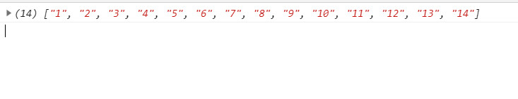
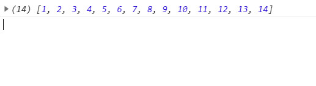

### 将数组扁平化并去除其中重复数据，最终得到一个升序且不重复的数组 

- 描述:
  
  已知如下数组：
    var arr = [ [1, 2, 2], [3, 4, 5, 5], [6, 7, 8, 9, [11, 12, [12, 13, [14] ] ] ], 10];
    编写一个程序将数组扁平化去并除其中重复部分数据，最终得到一个升序且不重复的数组

- 示例:
  
  ```js
  var arr = [ [1, 2, 2], [3, 4, 5, 5], [6, 7, 8, 9, [11, 12, [12, 13, [14] ] ] ], 10]
  input: flatArr(arr)

  output: 
  (14)["1", "2", "3", "4", "5", "6", "7", "8", "9", "10", "11", "12", "13", "14"]
  
  ```
  
- 实现:

  ```js
  function flatArr(arr) {
      return [...new Set(arr.toString().split(','))].sort((a,b)=>a-b)
  }
  ```

  

  ```js
  function flatArr(arr) {
      return [...new Set(arr.flat(Infinity))].sort((a,b)=>a-b)
  }
  ```

  

