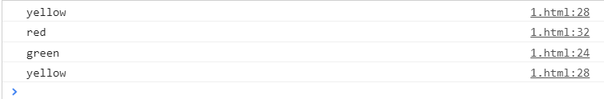

###  实现一个简易的红绿灯程序

- 描述：

  使用`js`编写一个程序，实现`红、黄、蓝`三种状态循环打印。

- 示例：

  

- 实现：

  1. 利用`setInterval()`定时显示状态

  ```js
   let n = 0
          function officeLight(){
              let status = ''
              if(n % 3 === 1) {
                  status = 'red'
              } else if (n % 3 === 2) {
                  status = 'green'
              } else {
                  status = 'yellow'
              }
              n++
              console.log(status)
          }
          setInterval(() => {
              officeLight()
          }, 3000)
  ```

  2. 利用`Promise()`异步回调显示

  ```js
  function sleep(status,duration){
      console.log(status)
      return new Promise((resolve,reject)=>{
          setTimeout(()=>{
              resolve()
          }, duration)
      })
  }
  async function officeLight(red=15000,green=5000,yellow=3000) {
      while(1) {
          await sleep('red',red)
          await sleep('green',green)
          await sleep('yellow',yellow)
      }
  }
  officeLight(3000,3000,3000)
  ```

  