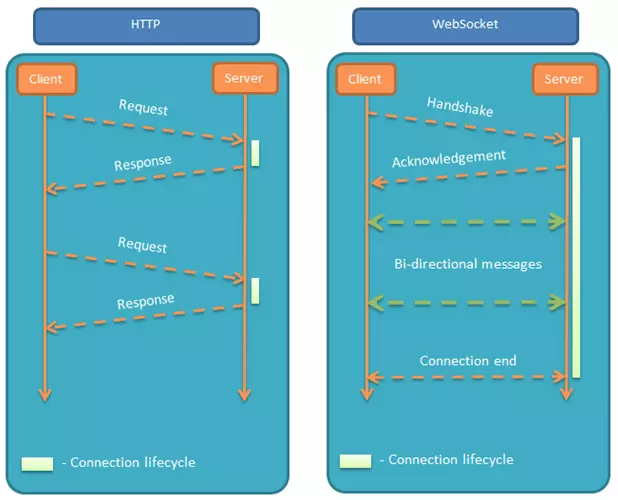

### 前端如何实现即时通讯？

**短轮询**

短轮询的原理很多简单，每隔一段时间客户端就发送一个请求，去获取服务器最新的数据，一定程度上模拟实现了即时通讯。

- 优点：兼容性强，实现简单。
- 缺点：延迟性高，非常消耗请求资源，影响性能。

**comet**

comet 有两种主要实现手段，一种是基于 AJAX 的长轮询（long-polling）方式，另一种是基于 `lframe`及`htmlfile`的流（streaming）方式，通常被叫做长连接。

长轮询优缺点：

- 优点：兼容性好，资源浪费较小
- 缺点：服务器 hold 连接会消耗资源，返回数据顺序无保证，难于管理维护

长连接优缺点：

- 优点：兼容性好，消息即时到达，不发无用请求
- 缺点： 服务器维护长连接消耗资源

**SSE**

SSE（Server-Sent Event，服务端推送事件）是一种允许服务端向客户端推送新数据的 HTML5 技术。

- 优点：基于 HTTP 而生，因此不需要太多改造就能使用，使用方便，而 websocket 非常复杂，必须借助成熟的库或框架
- 缺点：基于文本传输效率没有 websocket 高，不是严格的双向通信，客户端像服务端发送请求无法复用之前的连接，需要重新发出独立的请求

**Websocket**

Websocket 是一个全新的、独立的协议，基于 TCP 协议，与 http 协议兼容、却不会融入 http 协议，仅仅作为 html5 的一部分，其作用就是在服务器和客户端之间建立实时的双向通信。

- 优点：真正意义上的实时双向通信，性能好，低延迟。
- 缺点：独立于 http 的西医，因此需要额外的项目改造，使用复杂度高，必需引入成熟的库，无法兼容低版本浏览器。

**Web Worker**

Web Worker 的作用，就是为 JavaScript 创造多线程环境，允许主线程创建 Worker 线程，将一些任务分配给后者运行。

**Service workers**

Service workers 本质上充当 Web 应用程序与浏览器之间的代理服务器，也可以在网络可用时作为浏览器和网络间的代理，创建有效的离线体验。