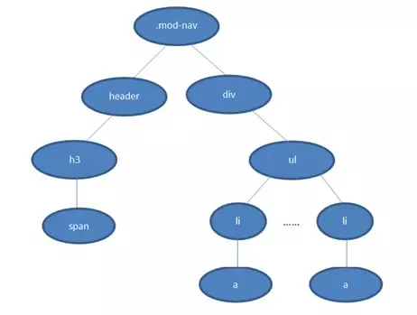

### 浏览器如何解析 CSS 选择器？

浏览器会`从右往左`解析 CSS 选择器。

我们知道 DOM Tree 与 Style Rules 合成为 Render Tree，实际上是需要将Style Rules 附着到 DOM Tree 上，因此需要根据选择器提供的信息对 DOM Tree 进行遍历，才能将样式附着到对应的 DOM 元素上。

以下面的 CSS 为例：

```css
.mod-nav h3 span { font-size: 16px; }
```

对应的 DOM Tree 如下：



若从左往右匹配，过程是：

1. 从 .mod-nav 开始，遍历子节点 header 和子节点 div
2. 然后各自向子节点遍历。在后侧 div 的分支中
3. 最后遍历到叶子节点 a，发现不符合规则，需要回溯到 ul 节点，在遍历下一个 li-a，一颗 DOM 树的节点动辄上千，这种效率很低。

若从右往左匹配，过程是：

1. 先找到所有的最右节点 span，对于每一个 span，向上寻找节点 h3
2. 由 h3 再向上寻找 class=mod-nav 的节点
3. 最后找到根元素 html 则结束这个分支的遍历

后者匹配性更好，是因为从右往左的匹配在第一步就筛选掉了大量的不符合条件的最右节点（叶子节点）；而从左往右的匹配规则的性能都浪费在了失败的查找上面。