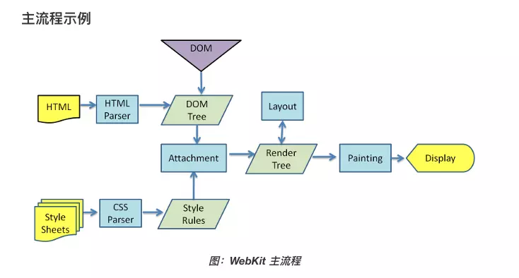

### 浏览器是如何渲染 UI 的？

1. 浏览器获取 HTML 文件，然后对文件进行解析，形成 DOM Tree。
2. 与此同时，进行 CSS 解析，生成 Style Rules。
3. 接着将 DOM Tree 与 Style Rules 合成为 Render Tree。
4. 接着进入布局（Layout）阶段，也就是为每个节点分配一个应出现的屏幕上的确切坐标。
5. 随后调用 GPU 进行绘制（Paint），遍历 Render Tree 的节点，并将元素呈现出来。

